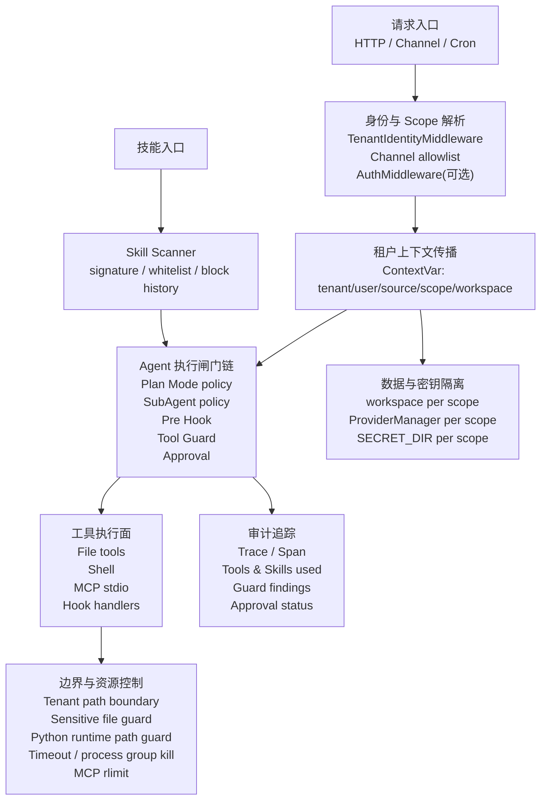

# Agent 安全现状实现梳理报告

## 1. 报告目标与分析口径

本文基于外部调研材料《Agent 框架安全分析报告》中总结的行业安全维度，对当前后端项目已有 Agent 安全能力进行模块化梳理。调研材料覆盖 Hermes、Codex Security、QwenPaw、AutoGPT/BabyAGI、LangChain 等代表性框架，安全维度包括身份认证、授权、隔离沙箱、输入验证、数据隐私、滥用防护、审计、供应链、运行时监控与合规。

当前项目不是单一“沙箱型 Agent 框架”，而是面向多租户、多通道、多工具和多 Agent 委派的后端运行平台。因此本文将行业维度映射为以下八类后端安全实现：

1. 请求准入与调用者身份
2. 租户、来源与密钥配置隔离
3. 工具调用前置网关与人工审批
4. 文件、Shell 与 Python 运行时路径边界
5. 技能供应链扫描
6. Hook、子 Agent 与委派权限控制
7. 审计追踪、日志与脱敏
8. 资源限制、超时与运行时治理

## 2. 总体结论

当前项目已经形成了以“请求 scope”为核心的 Agent 安全体系：入口处通过租户/来源身份头绑定 ContextVar，运行时把 scope 传递到工作区、Provider、审批、Tracing、工具和 Hook；工具调用前再经过 Plan Mode 策略、SubAgent 策略、Hook 策略、Tool Guard、人工审批和 tracing 记录，构成一条连续的执行闸门链。

相较行业调研中的通用框架，本项目安全实践的特点是：

- 强项不在单一容器沙箱，而在应用层多租户隔离、工具级策略、路径边界、审批流和审计追踪的组合。
- 对 Agent 高风险动作的控制较细：工具可被 guard、deny、审批、hook 阻断或子 Agent 权限策略拒绝。
- 对文件和 shell 有较多应用级补偿：租户根目录校验、敏感目录阻断、Python 子进程 sitecustomize 路径守护、命令路径静态扫描。
- 对技能生态已有供应链扫描雏形：YAML signature、block/warn/off 模式、哈希白名单和阻断历史。
- 明确边界是：当前未看到容器/内核级沙箱统一执行层；`process_limits.shell` 配置存在但 shell 执行路径未实际接入 rlimit；通用危险 shell 规则框架存在但默认实际启用规则有限；`skill_hook_http.approved_urls` 配置存在但当前集合分支默认放行，尚不能视为强制 URL allowlist。

## 3. 行业维度到项目模块的映射

| 行业安全维度 | 当前项目对应实现 | 主要代码落点 | 现状判断 |
| --- | --- | --- | --- |
| 认证与身份管理 | 可选 AuthMiddleware；HTTP 租户/来源身份中间件；Channel allowlist | `src/swe/app/auth.py`, `src/swe/app/middleware/tenant_identity.py`, `src/swe/app/channels/base.py` | 已有基础准入，但不是完整 RBAC |
| 授权与权限控制 | Tool Guard、denied tools、SubAgent readonly policy、Plan Mode allowlist | `src/swe/security/tool_guard/`, `src/swe/app/subagents/permissions.py`, `src/swe/agents/tool_guard_mixin.py` | 工具级控制较完整 |
| 隔离与沙箱 | 租户目录、Provider 密钥目录、路径边界、Python runtime path guard | `src/swe/config/context.py`, `src/swe/security/tenant_path_boundary.py`, `src/swe/security/python_runtime_path_guard.py` | 应用级隔离强；非容器级沙箱 |
| 输入验证与对抗鲁棒 | 身份值校验、shell/path 参数检查、技能 prompt injection 规则 | `src/swe/config/context.py`, `src/swe/agents/tools/shell.py`, `src/swe/security/skill_scanner/` | 多入口覆盖 |
| 数据保护与隐私 | Provider 按 scope 存储；secret 目录权限；tracing 脱敏 | `src/swe/providers/provider_manager.py`, `src/swe/app/auth.py`, `src/swe/tracing/sanitizer.py` | 租户级密钥隔离明确 |
| 模型滥用检测 | 技能扫描、Tool Guard 规则、Hook policy judge | `src/swe/security/skill_scanner/`, `src/swe/security/tool_guard/guardians/rule_guardian.py`, `src/swe/agents/hook_runtime/executor.py` | 主要是规则与流程防护，不是模型级滥用检测系统 |
| 审计与可追溯 | Trace/Span、tool start/end、skills/tools used、审批状态 | `src/swe/tracing/`, `src/swe/app/approvals/service.py` | 审计基础较好 |
| 供应链安全 | 技能扫描器、哈希白名单、阻断历史 | `src/swe/security/skill_scanner/` | 针对技能包有效；依赖/SBOM 未覆盖 |
| 运行时监控与应急 | tracing、超时、process group kill、MCP stdio rlimit wrapper | `src/swe/tracing/manager.py`, `src/swe/agents/tools/shell.py`, `src/swe/app/mcp/stdio_launcher.py` | 有运行时治理，但还不是完整监控告警体系 |

## 4. 模块化实现分析

### 4.1 请求准入与调用者身份

当前项目有两层准入能力。

第一层是 HTTP 控制台/API 的可选认证。`AuthMiddleware` 在 `SWE_AUTH_ENABLED` 为真且已有注册用户时生效，只保护 `/api/` 路由；登录、注册、健康检查、静态资源等公开路径跳过。用户密码使用 salted SHA-256 存在 `SECRET_DIR/auth.json`，token 是 HMAC-SHA256 签名并带 7 天过期时间，密码更新时会轮换 `jwt_secret` 使旧 token 失效。相关实现见 `src/swe/app/auth.py:37`, `src/swe/app/auth.py:87`, `src/swe/app/auth.py:120`, `src/swe/app/auth.py:189`, `src/swe/app/auth.py:345`。

第二层是租户/来源身份中间件。`TenantIdentityMiddleware` 要求非豁免路由携带 `X-Tenant-Id`，多数状态型路由还要求 `X-Source-Id`，并将 `tenant_id/user_id/source_id/scope_id` 写入 `request.state` 和 ContextVar。身份值校验禁止空值、超长、`..`、斜杠、反斜杠和控制字符，从入口减少路径穿越和 scope 污染风险。相关实现见 `src/swe/app/middleware/tenant_identity.py:170`, `src/swe/app/middleware/tenant_identity.py:200`, `src/swe/app/middleware/tenant_identity.py:265`, `src/swe/app/middleware/tenant_identity.py:295`, `src/swe/config/context.py:202`。

IM/Channel 侧还有 allowlist 准入。`BaseChannelConfig` 支持 `dm_policy/group_policy` 为 `open` 或 `allowlist`，`BaseChannel._check_allowlist()` 会根据 `sender_id` 和群聊/私聊策略拒绝未授权发送者。相关实现见 `src/swe/config/config.py:90` 和 `src/swe/app/channels/base.py:294`。

边界：HTTP Auth 是单用户、可选能力；租户身份更多是“可信上游传入的身份上下文”，不等价于完整用户认证、组织角色和 RBAC。

### 4.2 租户、来源与密钥配置隔离

项目的多租户隔离核心是 `tenant_id + source_id -> scope_id`。`resolve_scope_id()` 在 tenant/source 同时存在时生成 canonical runtime scope；`resolve_runtime_tenant_id()` 和 `resolve_storage_tenant_id()` 区分运行时目录与存储目录语义，兼容 `default + source` 模板目录以及历史 scope 输入。相关实现见 `src/swe/config/context.py:229`, `src/swe/config/context.py:264`, `src/swe/config/context.py:292`, `src/swe/config/context.py:325`, `src/swe/config/context.py:387`。

Provider 配置隔离落在 `SECRET_DIR/<effective_scope>/providers`。`ProviderManager._resolve_effective_provider_tenant_id()` 根据当前上下文和显式 tenant 解析最终 storage tenant id；`get_instance()` 使用该 id 作为多实例 singleton key；`ensure_tenant_provider_storage()` 初始化租户 Provider 目录并用文件锁防止并发复制冲突。相关实现见 `src/swe/providers/provider_manager.py:212`, `src/swe/providers/provider_manager.py:351`, `src/swe/providers/provider_manager.py:385`, `src/swe/providers/provider_manager.py:436`, `src/swe/providers/provider_manager.py:524`。

密钥与本地认证文件也放在 `SECRET_DIR`，例如 Auth 的 `auth.json` 保存时会对父目录尝试设置 `0700`，对文件设置 `0600`。相关实现见 `src/swe/app/auth.py:70`, `src/swe/app/auth.py:77`, `src/swe/app/auth.py:189`。

这一层可以概括为“scope 贯穿式隔离”：scope 不是只用于请求路由，而是继续传递到 Provider、工作区、审批、Tracing、工具路径和 Hook 模型调用。

### 4.3 工具调用前置网关与人工审批

Tool Guard 是当前项目 Agent 安全的核心运行时闸门。`ToolGuardEngine` 默认装配 `FilePathToolGuardian` 和 `RuleBasedToolGuardian`，可通过环境变量或 `security.tool_guard` 配置控制启用状态、guarded tools 和 denied tools。默认 guarded tools 包括 shell、读写文件、编辑文件、发送文件等高风险工具；denied tools 可无条件拒绝，不进入审批。相关实现见 `src/swe/security/tool_guard/engine.py:36`, `src/swe/security/tool_guard/engine.py:85`, `src/swe/security/tool_guard/engine.py:142`, `src/swe/security/tool_guard/utils.py:19`, `src/swe/security/tool_guard/utils.py:64`, `src/swe/security/tool_guard/utils.py:99`。

规则守护器从 YAML 和配置加载正则规则，扫描工具参数。当前内置 shell 规则文件中有较完整的危险命令规则模板，但实际未注释启用的规则有限，主要覆盖 `swe cron create/update` 这类定时任务创建/更新场景；数据库危险命令规则由 source 级开关控制，读取失败时默认启用，体现 fail-safe 思路。相关实现见 `src/swe/security/tool_guard/guardians/rule_guardian.py:39`, `src/swe/security/tool_guard/guardians/rule_guardian.py:154`, `src/swe/security/tool_guard/guardians/rule_guardian.py:240`, `src/swe/security/tool_guard/guardians/rule_guardian.py:306`, `src/swe/security/tool_guard/guardians/rule_guardian.py:345`。

文件守护器 `FilePathToolGuardian` 是 `always_run=True`，即使工具不在 guarded scope，也会扫描敏感文件路径。默认保护 `SECRET_DIR/`，并能识别文件工具参数、shell 重定向和 path-like 字符串。相关实现见 `src/swe/security/tool_guard/guardians/file_guardian.py:19`, `src/swe/security/tool_guard/guardians/file_guardian.py:31`, `src/swe/security/tool_guard/guardians/file_guardian.py:55`, `src/swe/security/tool_guard/guardians/file_guardian.py:162`, `src/swe/security/tool_guard/guardians/file_guardian.py:291`。

`ToolGuardMixin._acting()` 把该能力接入真实工具执行之前：先执行 Plan Mode/SubAgent policy，再执行 pre-hook，再由 tool guard 决定 auto deny、preapproved、needs approval 或放行。guard 决策在锁内完成，实际工具执行在锁外，避免并行工具调用时共享状态竞态。相关实现见 `src/swe/agents/tool_guard_mixin.py:1352`, `src/swe/agents/tool_guard_mixin.py:1460`, `src/swe/agents/tool_guard_mixin.py:1532`, `src/swe/agents/tool_guard_mixin.py:1588`。

人工审批由 `ApprovalService` 管理 pending/completed 记录。审批记录带 `session_id/user_id/channel/tool_name/scope_id/findings_count/extra`，读取、resolve、consume 都要求当前 scope 匹配；`consume_approval()` 还会比较批准时保存的工具参数，防止把一次批准复用于不同命令。相关实现见 `src/swe/app/approvals/service.py:40`, `src/swe/app/approvals/service.py:83`, `src/swe/app/approvals/service.py:108`, `src/swe/app/approvals/service.py:146`, `src/swe/app/approvals/service.py:263`。

审批命令在 runner 侧处理，`/approve` 或 `/deny` 可带 request id；无 id 时按 session FIFO 选择 pending；超时后自动拒绝。相关实现见 `src/swe/app/runner/runner.py:402`, `src/swe/app/runner/runner.py:454`, `src/swe/app/runner/runner.py:1746`。

### 4.4 文件、Shell 与 Python 运行时路径边界

项目没有把所有工具统一放进容器/内核沙箱，但在应用层做了较强的路径边界。

`tenant_path_boundary` 提供统一路径解析：默认以当前 Agent workspace 或租户根目录作为 base，解析相对路径、展开 `~`、跟随 symlink，再校验最终 resolved path 必须位于当前租户根目录之内；失败时返回标准化 permission denied 文案，避免泄露其他租户路径。相关实现见 `src/swe/security/tenant_path_boundary.py:51`, `src/swe/security/tenant_path_boundary.py:73`, `src/swe/security/tenant_path_boundary.py:96`, `src/swe/security/tenant_path_boundary.py:230`, `src/swe/security/tenant_path_boundary.py:293`。

文件工具读写、编辑、追加通过 `_resolve_file_path()` 和 `_resolve_writable_file_path()` 走 tenant boundary，并对写入路径的父目录做租户内校验。相关实现见 `src/swe/agents/tools/file_io.py:54`, `src/swe/agents/tools/file_io.py:80`。搜索工具同样通过 `_resolve_search_root()` 校验搜索根目录，见 `src/swe/agents/tools/file_search.py:136`。

Shell 工具在执行前先解析工作目录，再用 `_validate_shell_paths()` 检查命令里的显式 path token 是否越界；Python 命令还会静态扫描 `open/pathlib/os/shutil/subprocess` 等常见文件访问与执行路径。相关实现见 `src/swe/agents/tools/shell.py:285`, `src/swe/agents/tools/shell.py:991`, `src/swe/agents/tools/shell.py:1027`, `src/swe/agents/tools/shell.py:1033`。

Shell 启动的 Python 子进程还会注入 `sitecustomize.py`。`prepare_python_runtime_path_guard_env()` 把临时 guard 目录放入 `PYTHONPATH`，在 Python 进程启动时包装 `open/os/pathlib/shutil/subprocess` 等函数，并注册 audit hook，对运行时文件访问和 subprocess 参数继续做租户路径检查。相关实现见 `src/swe/security/python_runtime_path_guard.py:24`, `src/swe/security/python_runtime_path_guard.py:353`, `src/swe/security/python_runtime_path_guard.py:418`, `src/swe/security/python_runtime_path_guard.py:454`, `src/swe/security/python_runtime_path_guard.py:477`, `src/swe/security/python_runtime_path_guard.py:558`。

Shell 执行还带硬超时和进程组终止：Unix 通过 `start_new_session=True` 创建进程组，超时时先 SIGTERM 后 SIGKILL；Windows 使用 `taskkill /F /T` 终止进程树。相关实现见 `src/swe/agents/tools/shell.py:641`, `src/swe/agents/tools/shell.py:769`, `src/swe/agents/tools/shell.py:861`, `src/swe/agents/tools/shell.py:892`。

边界：这不是 Docker/Bubblewrap/Seatbelt 级别的系统沙箱；它主要防文件路径越界与部分 Python runtime 越界。任意 native binary、网络访问、复杂 shell 行为仍需要更底层的沙箱或部署层限制补足。

### 4.5 技能供应链扫描

技能扫描器用于在技能激活或安装前识别高风险内容。`SkillScanner` 发现技能目录文件，跳过 inert/archive/binary 等扩展，限制扫描文件数与单文件大小，默认使用 `PatternAnalyzer`。相关实现见 `src/swe/security/skill_scanner/scanner.py:77`, `src/swe/security/skill_scanner/scanner.py:117`, `src/swe/security/skill_scanner/scanner.py:149`, `src/swe/security/skill_scanner/scanner.py:249`。

扫描模式支持 `block/warn/off`，优先级为环境变量 `SWE_SKILL_SCAN_MODE` 高于配置；配置模型默认是 `warn`，配置加载失败时 helper 回退到 `block`；白名单支持按技能名和内容 SHA-256 hash 绕过；扫描结果有 mtime cache 和超时保护。相关实现见 `src/swe/security/skill_scanner/__init__.py:83`, `src/swe/security/skill_scanner/__init__.py:122`, `src/swe/security/skill_scanner/__init__.py:142`, `src/swe/security/skill_scanner/__init__.py:416`。

内置 signature 覆盖 prompt injection、command injection、data exfiltration、hardcoded secrets、obfuscation、social engineering、supply chain、unauthorized tool use。规则会被 `PatternAnalyzer` 编译并按文件类型、policy、docs skip、severity override 和测试凭据过滤执行。相关实现见 `src/swe/security/skill_scanner/analyzers/pattern_analyzer.py:39`, `src/swe/security/skill_scanner/analyzers/pattern_analyzer.py:164`, `src/swe/security/skill_scanner/analyzers/pattern_analyzer.py:237`, `src/swe/security/skill_scanner/analyzers/pattern_analyzer.py:266`。

发现 CRITICAL/HIGH 时，block 模式会抛出 `SkillScanError` 并写入 `skill_scanner_blocked.json` 历史；warn 模式会记录 warned 但继续执行。相关实现见 `src/swe/security/skill_scanner/__init__.py:188`, `src/swe/security/skill_scanner/__init__.py:232`, `src/swe/security/skill_scanner/__init__.py:491`。

边界：这是针对技能包内容的静态 signature 扫描，不覆盖 Python 依赖树、Docker 镜像、SBOM、包签名或模型权重供应链。

### 4.6 Hook、子 Agent 与委派权限控制

Hook 机制提供工具前后和停止前的策略扩展点。`ToolGuardMixin._acting()` 在 tool guard 之前执行 `PRE_TOOL_USE` hook；hook 可以更新输入、BLOCK/DENY/STOP，也可以 ASK 触发审批；工具执行成功或失败后分别触发 `POST_TOOL_USE` 或 `POST_TOOL_USE_FAILURE`。相关实现见 `src/swe/agents/tool_guard_mixin.py:1387`, `src/swe/agents/tool_guard_mixin.py:1405`, `src/swe/agents/tool_guard_mixin.py:1491`, `src/swe/agents/tool_guard_mixin.py:1517`。

Hook handler 支持 command、HTTP 和 prompt judge。command handler 的 cwd、argv 和 shell command 会校验在 workspace 内；prompt judge 明确把 HookContext 当作不可信数据，要求只输出 JSON 决策，降低 prompt injection 对 policy judge 的影响。相关实现见 `src/swe/agents/hook_runtime/executor.py:67`, `src/swe/agents/hook_runtime/executor.py:158`, `src/swe/agents/hook_runtime/executor.py:230`, `src/swe/agents/hook_runtime/executor.py:280`, `src/swe/agents/hook_runtime/executor.py:403`。

技能自带 hook 的加载器会把 handler id namespace 到 `skill:<skill_name>:`，要求 command handler 不能使用 shell command 字符串、不能定义 literal env，只能引用 skill `scripts/` 下的单个脚本；cwd 也必须位于 skill root 和 workspace 内。相关实现见 `src/swe/agents/hook_runtime/skill_loader.py:33`, `src/swe/agents/hook_runtime/skill_loader.py:102`, `src/swe/agents/hook_runtime/skill_loader.py:152`, `src/swe/agents/hook_runtime/skill_loader.py:204`。

重要边界：`SecurityConfig` 中已有 `skill_hook_http.approved_urls`，runner 也会加载租户配置传给 skill hook loader，见 `src/swe/config/config.py:1505` 和 `src/swe/app/runner/runner.py:528`。但当前 `skill_loader._is_http_url_approved()` 只有传入 callable validator 时才实际校验 URL，普通集合或空值分支都会放行，见 `src/swe/agents/hook_runtime/skill_loader.py:242` 和 `src/swe/agents/hook_runtime/skill_loader.py:261`。因此不能把 HTTP hook allowlist 视为已强制落地能力。

子 Agent 采用 readonly MVP 权限模型。有效权限由 parent、subagent、runtime、workspace 四层策略取交集，deny 优先；工具必须在 allow 且不在 deny；shell 只允许 allowlist 命令，拒绝管道、重定向、命令串联、sed in-place、外部执行选项、测试执行等。相关实现见 `src/swe/app/subagents/permissions.py:18`, `src/swe/app/subagents/permissions.py:52`, `src/swe/app/subagents/permissions.py:85`, `src/swe/app/subagents/models.py:169`, `src/swe/app/subagents/models.py:232`。

`ToolGuardMixin` 在 subagent 运行态会强制执行该策略，并在缺少/非法策略时拒绝工具调用。相关实现见 `src/swe/agents/tool_guard_mixin.py:1216`。

### 4.7 审计追踪、日志与脱敏

Tracing 是审计与运行时可观测的基础。`Trace` 记录 source、user、session、channel、token、tools_used、skills_used、status、error、user_message；`Span` 记录 LLM、工具和技能调用，包含 tool input/output、MCP server、错误与耗时。相关实现见 `src/swe/tracing/models.py:35` 和 `src/swe/tracing/models.py:112`。

`TraceManager` 负责创建 trace、attach existing trace 时校验 user/session/channel/source 必须匹配，避免不同身份复用同一个 trace；工具调用 start/end 会产生 span，并做技能归因。相关实现见 `src/swe/tracing/manager.py:320`, `src/swe/tracing/manager.py:379`, `src/swe/tracing/manager.py:730`, `src/swe/tracing/manager.py:1007`, `src/swe/tracing/manager.py:1107`。

Tracing 默认支持脱敏与截断：敏感 key 包括 `api_key/password/secret/token/authorization/private_key/access_token/refresh_token/session_id` 等；同时支持按当前上下文登记 secret value 并在字符串中替换为 `[REDACTED]`。相关实现见 `src/swe/tracing/config.py:38` 和 `src/swe/tracing/sanitizer.py:7`。

TraceStore 将 trace 和 span 写入 MySQL；trace 表记录 source_id、user_id、session_id、tools_used、skills_used、status、error、user_message、user_name、bbk_id 等字段。相关实现见 `src/swe/tracing/store.py:115`。

Tool Guard 自身也会结构化打印 finding，并在内存消息里标记 `TOOL_GUARD_DENIED_MARK`，以便审批通过或拒绝后清理/保留上下文。相关实现见 `src/swe/security/tool_guard/utils.py:129`, `src/swe/security/tool_guard/models.py:16`, `src/swe/agents/tool_guard_mixin.py:620`。

边界：审批服务当前主要是进程内 pending/completed 状态，虽然 tracing 与消息历史可还原操作链，但未看到审批记录持久化到专门审计表的实现。日志防篡改、集中 SIEM、告警规则也不在当前实现范围内。

### 4.8 资源限制、超时与运行时治理

系统存在多类超时与限流配置。全局常量包括 LLM 并发、QPM、MCP 调用超时、Query 超时、Tool Guard 审批超时等，见 `src/swe/constant.py:269`, `src/swe/constant.py:282`, `src/swe/constant.py:320`, `src/swe/constant.py:347`, `src/swe/constant.py:430`。

安全配置里有 `ProcessLimitsConfig`，支持 shell 和 MCP stdio 两个 scope，默认启用 shell、CPU 30 秒、内存 150 MB；模型校验要求启用时必须至少有一个目标和一个限制。相关实现见 `src/swe/config/config.py:1480`。

`process_limits.py` 能解析当前租户的进程限制策略，并在 Unix 平台构造 `preexec_fn` 调用 `resource.setrlimit(RLIMIT_CPU/RLIMIT_AS)`。相关实现见 `src/swe/security/process_limits.py:43`, `src/swe/security/process_limits.py:70`, `src/swe/security/process_limits.py:101`。

MCP stdio launcher 已接入该策略：当 `mcp_stdio` scope 需要 enforcement 时，会改用 `python -m swe.app.mcp.stdio_launcher --cpu-time-limit-seconds ... --memory-max-bytes ... -- target` 包装目标 MCP 进程，并在 launcher 中设置 rlimit 后 `execvpe`。相关实现见 `src/swe/app/mcp/stdio_launcher.py:34` 和 `src/swe/app/mcp/stdio_launcher.py:83`。

边界：Shell 工具当前主要依靠 timeout 和进程组 kill，未看到 `execute_shell_command()` 路径调用 `resolve_current_process_limit_policy("shell")` 或 `preexec_fn`，因此 `process_limits.shell` 不能视为已生效的 shell rlimit。该点可作为后续创新/改进空间。

## 5. 当前项目安全能力分层图

## 6. 已有实现的创新表达线索

后续写创新文档时，可以把当前实现抽象为以下几个关键词：

- “Scope 贯穿式安全上下文”：租户、来源、用户和工作区不是只在入口使用，而是贯穿 Provider、工具、审批、Tracing、Hook 和子 Agent。
- “工具调用前置决策闸门链”：Plan Mode、SubAgent 权限、Hook、Tool Guard、人工审批按顺序组合，形成可插拔、可审计、可阻断的 Agent 行为控制链。
- “应用级租户路径沙箱”：在未统一使用内核/容器沙箱的情况下，通过路径解析、symlink 检测、敏感目录守护和 Python runtime monkey patch/audit hook 构造应用层隔离边界。
- “技能供应链的轻量签名扫描”：用静态 signature、哈希白名单、block/warn 模式和阻断历史，为 Agent 技能生态提供安装/激活前的安全门槛。
- “委派 Agent 最小权限模型”：子 Agent 权限由多层策略取交集，deny 优先，shell 只读 allowlist，防止委派扩大主 Agent 权限。
- “审计先行的 Agent 运行时”：trace/span 记录工具、技能、MCP、错误、token、用户和来源，同时对敏感字段脱敏，为后续安全运营和异常检测预留数据底座。

## 7. 风险边界与后续补强点

本文聚焦已有实现，因此这里只列与现状判断相关的边界：

1. 容器/内核级沙箱未统一落地。当前路径边界和 Python runtime guard 是应用层控制，不能完全替代 Docker/Bubblewrap/Seatbelt/AppContainer 等系统沙箱。
2. HTTP Auth 是可选单用户模型，不是企业级 RBAC/SSO/MFA；租户身份头需要可信网关或上游系统保证真实性。
3. `skill_hook_http.approved_urls` 配置尚未强制校验普通 URL 集合，当前实现对 skill-owned HTTP hooks 默认放行。
4. `process_limits.shell` 配置存在，但 shell 执行路径未看到 rlimit 接入；MCP stdio 已接入。
5. 技能扫描覆盖技能包内容，不覆盖第三方依赖、镜像、SBOM、签名验证和模型权重供应链。
6. 审批状态主要是进程内服务；长期可追溯需要依赖 tracing、消息历史或后续持久化审批审计。
7. 当前滥用防护主要是规则、路径和流程控制，不是完整的模型行为安全分类器或异常行为检测系统。

## 8. 结语

当前项目已经具备较完整的 Agent 安全工程基础：入口身份收敛、scope 隔离、Provider 密钥隔离、工具前置网关、人工审批、路径边界、技能扫描、子 Agent 最小权限和 tracing 审计共同构成纵深防御。与行业调研对比，项目更接近 QwenPaw/Hermes 的多层防护思路，但实现重心在应用层策略和多租户运行时，而非容器沙箱本身。

因此，创新文档可以围绕“面向多租户 Agent 平台的纵深安全控制链”展开：以 scope 为安全主线，以工具调用闸门链为运行时控制核心，以技能扫描和审计追踪覆盖生态入口与事后追溯，再明确用系统沙箱、强制 HTTP hook allowlist、shell rlimit 和持久化审批审计作为下一阶段增强方向。
