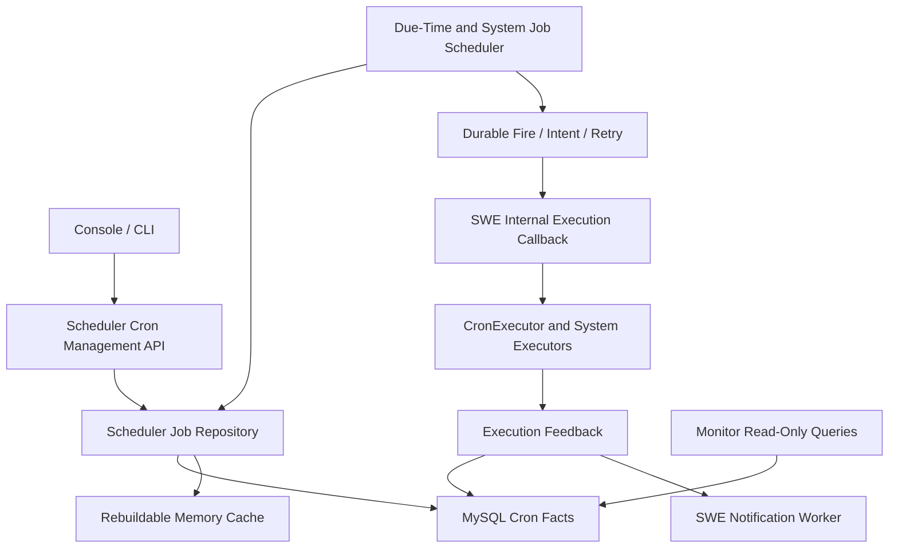
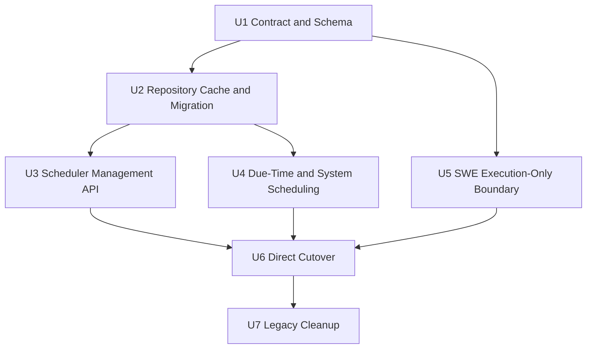
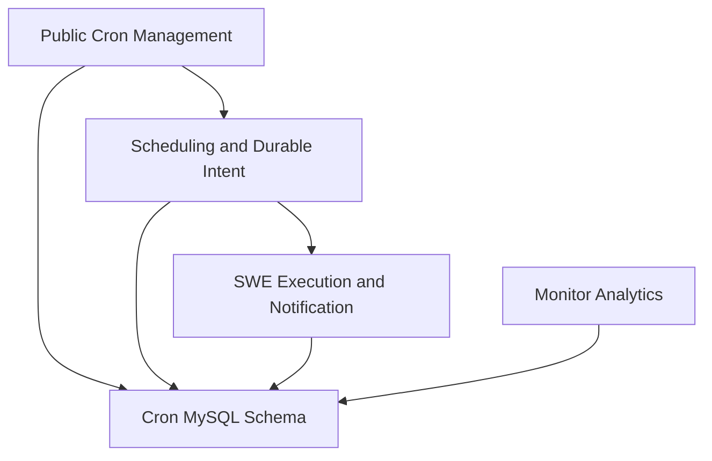

# refactor: Move Cron Ownership to Scheduler with Direct Cutover

## Summary

本计划建议拆成 **7 个实施步骤、4 个发布阶段**：把定时任务定义、持久状态、公共 API、普通任务和系统任务调度统一迁入 Scheduler，以 MySQL 为唯一主源、进程内存为可重建缓存；Console 和 CLI 在切换窗口内直接改用 Scheduler，不建设 SWE 代理兼容层。SWE 只保留执行、任务会话资源和通知，Monitor 只保留查询与分析。

---

## Problem Frame

当前定时任务定义由每个 SWE workspace 下的 `jobs.json` 保存，`CronManager` 同时承担文件 CRUD、状态维护、外部调度注册、广播编排、任务执行和通知协同。任务状态还分散在 `CronManager._states`、任务 `meta`、`system_jobs.json`、execution 表和若干进程内对象中。

现有 Scheduler 已拥有 batch dispatch、durable intent、execution feedback、重试和 worker capacity，但公共 Cron API、普通任务 due-time、Heartbeat、Dream、Cleanup、Archive 仍由 SWE 或外部调度平台驱动。Monitor 又创建并写入 `swe_cron_jobs` 影子表，形成文件、内存、Monitor 表和 Scheduler 表之间的多份状态。

目标不是把整个 `CronManager` 搬到 Scheduler，而是明确拆开：

- Scheduler：任务定义和持久状态的唯一写 owner、公共管理 API、普通/广播/系统任务调度、fire/intent/retry/lease。
- SWE：接收不可变任务快照并执行，继续负责 Agent/Text 执行、模型与技能上下文、任务会话资源、渠道推送和通知。
- Monitor：只读查询 Scheduler 所拥有的 Cron 事实表和 execution/dispatch 数据。

---

## Requirements

- R1. Scheduler 数据库必须成为任务定义和所有可恢复任务状态的唯一持久主源；内存只能作为可丢弃、可重建的缓存。
- R2. Scheduler 必须接管现有公共 Cron 管理能力，包括列表、详情、创建、替换、删除、暂停、恢复、立即运行、状态、已读、广播和 batch dispatch。
- R3. Console 和 CLI 必须在同一切换版本中直接调用 Scheduler 的 `/api/scheduler/cron/*`，不得通过 SWE 代理。
- R4. 普通任务、广播任务以及 Heartbeat、Dream、Cleanup、Archive 系统任务必须在同一迁移范围内进入 Scheduler。
- R5. Scheduler 必须统一生成 durable fire/intent，保证定时触发、手动触发和重试具有稳定幂等身份。
- R6. Scheduler 下发 SWE 时必须携带完整 `job_spec`、`definition_version`、`scheduled_fire_at` 和 fire/intent/attempt 身份；SWE 不得再按 `job_id` 查询 `jobs.json`。
- R7. SWE 必须继续拥有 `CronExecutor`、Agent/Text 执行、模型/技能解析、渠道推送、任务会话资源、Heartbeat/Dream 执行、文件 Cleanup/Archive 执行和通知发送。
- R8. Monitor 必须停止创建或写入 Cron 定义、execution 和 notification 状态，保留查询、统计、告警和展示能力。
- R9. `jobs.json`、`system_jobs.json` 和进程内可恢复状态必须可幂等导入数据库，切换前必须完成全量和最终增量核对。
- R10. 切换后不得继续双写 `jobs.json`；数据库写失败时写请求必须失败，不能降级为仅写内存。
- R11. 迁移必须保持现有任务隔离、广播关系、暂停/自动暂停、未读、任务会话绑定、时区、通知延迟和 execution feedback 语义。
- R12. 迁移必须提供不依赖长期双写的回滚路径：停止新写入后，可把 Scheduler 数据库导出为旧版 `jobs.json` 快照并恢复旧路由。

---

## Scope Boundaries

- 不建设 SWE `/cron/*` 到 Scheduler 的代理层，也不长期保留两套公共 API。
- 不重写 `CronExecutor`、Agent/Text 执行、模型选择、技能注入、渠道推送或现有通知算法。
- `cron_auth.json` 含鉴权令牌和用户信息，继续由 SWE 的安全存储管理，不并入普通 Cron 定义表。
- `asyncio.Task`、信号量、正在运行的协程句柄等不可恢复运行时对象不写数据库；只持久化定义、任务状态、执行身份、进度和恢复所需信息。
- 不在切换后继续双写文件和数据库；文件只在切换前导入、切换窗口备份和回滚导出时使用。
- 不把 Monitor 的分析 UI 和统计口径迁入 Scheduler。
- 不在本计划中重做租户目录或 Source System 配置体系；Scheduler 可通过窄化的内部契约获取租户列表和接收系统任务配置变更。
- 不把本次工作扩展为通用工作流引擎；只统一现有 Cron 和系统维护任务。

### Deferred to Follow-Up Work

- 完全删除外部调度平台的通用适配代码：在 Scheduler 自主 due-time 稳定运行并完成观察期后单独清理非 Cron 使用场景。
- 将 Monitor 改为完全通过 Scheduler 查询 API 获取数据：本次保留对 Cron 事实表的只读数据库访问，避免同时重写全部分析查询。

---

## Context & Research

### Relevant Code and Patterns

- `src/swe/app/crons/api.py`：当前 `/cron` 公共路由，共有 19 个 handler 直接依赖 `get_cron_manager`。
- `src/swe/app/crons/manager.py`：`CronManager` 同时包含定义持久化、外部调度同步、执行、任务视图、通知状态和系统任务注册；`_mutate_jobs_file_locked` 是 `jobs.json` 写入总入口。
- `src/swe/app/crons/repo/base.py` 和 `src/swe/app/crons/repo/json_repo.py`：当前 whole-file repository 和内存快照模式。
- `src/swe/app/crons/models.py`：现有 `CronJobSpec`、`CronJobState`、`CronTaskView` 和 `JobsFile.definition_version` 是迁移契约基线。
- `src/swe/app/crons/executor.py`：应留在 SWE 的执行边界，只有 `CronManager` 直接构造它。
- `src/swe/app/routers/internal.py`：当前内部 callback 会按 `job_id` 回查 `CronManager`，并分派 job/heartbeat/dream/cleanup/archive。
- `src/swe/app/workspace/workspace.py`：当前为每个 workspace 注入 `JsonJobRepository(workspace/jobs.json)`。
- `src/swe/app/source_system_config/task_scheduler.py`：Cleanup/Archive 的注册属于调度职责，真实文件操作属于 SWE 执行职责。
- `scheduler/src/scheduler/app/services/cron/scheduling_service.py`：已有 Scheduler loop、dispatch、execution feedback 和 capacity；`enqueue_due_parent_intents_once` 当前为空实现，`_dispatch_one` 只接受 parent/child。
- `scheduler/src/scheduler/app/services/cron/dispatch_intent_service.py`：已有 durable intent、事件、重试、stale recovery、scope lease 和 worker capacity 模式，应扩展而不是重写。
- `scheduler/src/scheduler/app/database/schema.py`：当前创建 execution/dispatch 表，但不创建 `swe_cron_jobs`。
- `monitor/src/monitor/app/database/schema.py` 和 `monitor/src/monitor/app/services/cron/sync_service.py`：当前拥有 `swe_cron_jobs` DDL 和影子写入，需改为只读。
- `console/src/api/modules/cronjob.ts` 和 `src/swe/cli/cron_cmd.py`：当前所有调用均指向 SWE `/cron/*`。
- `docs/plans/2026-07-01-001-independent-cron-scheduling-service-design.md`、`docs/plans/2026-07-02-003-scheduler-feedback-safety-supplement.md` 和 `docs/plans/2026-07-02-004-batch-dispatch-scheduler-implementation-report.md`：现有 batch Scheduler、feedback 幂等和容量调整的前置设计。

### GitNexus Impact Findings

- `get_cron_manager`：HIGH，19 个直接调用者，覆盖全部公共 Cron handler。
- `CronManager`：MEDIUM，5 个直接导入、19 个上游依赖。
- `_mutate_jobs_file_locked`：MEDIUM，8 个直接调用者、33 个三层上游依赖，覆盖定义保存、删除、暂停/恢复、已读、执行成功、任务会话清理和 external binding。
- `CronSchedulingService`：LOW，3 个直接导入、4 个总上游依赖，适合作为 Scheduler 扩展边界。
- `CronManager.run_job`：图上只有 1 个直接公共 API 调用者，但内部 callback 的动态调用不会被完整静态图捕获，计划按更高风险处理。
- `CronExecutor`：只有 SWE `CronManager` 直接引用，是清晰的保留边界。

### Institutional Learnings

- 仓库内没有找到与本次迁移直接相关的 `docs/solutions/` 条目。
- 既有 Scheduler 设计已经明确：dispatch 与 worker capacity 调整是两个独立循环；execution feedback 以 `intent_id + batch_id + dispatch_attempt` 幂等；这些约束继续保留。
- 既有实现报告说明 Scheduler 生产启动默认不自动执行 DDL，因此数据库迁移必须同时提供部署 migration，并由发布流程或 DBA 执行。

### External References

- [MySQL 8.4 Locking Reads](https://dev.mysql.com/doc/refman/8.4/en/innodb-locking-reads.html)：`FOR UPDATE SKIP LOCKED` 适合多 worker 领取队列表记录，但不适合一般一致性查询。
- [MySQL 8.4 INSERT Statement](https://dev.mysql.com/doc/refman/8.4/en/insert.html)：唯一键与 `ON DUPLICATE KEY UPDATE` 可支持幂等 backfill/upsert。
- [MySQL 8.4 Transactions](https://dev.mysql.com/doc/refman/8.4/en/commit.html)：最终增量导入和核对需要显式事务/一致性快照，而不能依赖当前连接的逐语句 autocommit。
- [MySQL 8.4 Deadlocks](https://dev.mysql.com/doc/refman/8.4/en/innodb-deadlocks.html)：多表状态迁移和 intent 领取必须保持短事务、固定加锁顺序并重试死锁。

---

## Key Technical Decisions

| Decision | Resolution and rationale |
|---|---|
| Persistent owner | Scheduler 是 Cron 定义、状态、fire、intent 的唯一 writer；Monitor 使用只读凭据，SWE 不再持有定义 repository。 |
| Database placement | 本次复用同一套 MySQL Cron 事实表，消除 Monitor 影子表；部署必须让 Scheduler 和 Monitor 指向同一 Cron schema，但只有 Scheduler 拥有写权限。 |
| Job identity | 数据库内部使用稳定的 `job_key` 作为主键，并对 `scope_id + agent_id + job_id` 建业务唯一约束，避免假设 `job_id` 全局唯一；现有 URL 仍传 `job_id`，身份头补齐 scope，fire/intent/execution 外键统一引用 `job_key`。 |
| Definition shape | `spec_json` 保存完整版本化 `CronJobSpec`，同时投影 enabled、cron、timezone、task_type、source、origin 等查询和调度字段；投影与 JSON 在同一事务更新。 |
| Mutable state | 暂停原因、next/last run、unread、task chat/session binding、external binding 和 definition version 从 `meta`/内存拆到持久状态列或状态表。 |
| Cache policy | Scheduler 使用 write-through/read-through 缓存；缓存记录 definition version，可按版本重载；缓存失效或进程重启时从 DB 重建，DB 不可用时拒绝写入。 |
| Public cutover | 新公共路径为 `/api/scheduler/cron/*`；Console、CLI、部署路由一次切换，不保留 SWE proxy。服务端可提前部署但保持管理写入和 due loop 关闭。 |
| Execution handoff | Scheduler 发送不可变任务快照和幂等身份；SWE 只校验、领取 execution 身份并调用 `CronExecutor`，不查询任务定义。 |
| Notification ownership | 通知发送动作留在 SWE；待发送领取、sent/failed、未读/已读等 Cron 通知状态统一通过 Scheduler 内部 API 变更，Monitor 不再承接任何 Cron 状态写入。 |
| Scheduling | 普通、广播和系统任务都先产生唯一 durable fire，再进入既有 intent/dispatch/retry 流；手动运行也走同一路径。 |
| System tasks | Heartbeat、Dream、Cleanup、Archive 以 `job_origin=system` 的定义进入 Scheduler；SWE 只执行对应 task type。 |
| Rollback | 不长期双写；切换后回滚必须先冻结 Scheduler 写入，再由 DB 反向导出旧版 `jobs.json`，恢复旧服务和外部调度注册。 |

---

## Open Questions

### Resolved During Planning

- 系统任务是否一起迁移：一起迁移，和普通任务使用同一 Scheduler 定义、fire 和 intent 体系。
- 是否保留 SWE API 兼容代理：不保留，Console 和 CLI 直接切换 Scheduler。
- 内存是否可作为降级主源：不可；内存只是缓存，写数据库失败即返回失败。
- 通知能力是否迁入 Scheduler：发送行为不迁；Scheduler 保存并唯一写入通知相关 execution/claim/sent/failed/unread 状态，SWE notification worker 通过 Scheduler 内部 API 领取和回写。
- Monitor 是否继续写 Cron 定义：不继续；只保留读取和分析。
- 是否把运行中的协程对象持久化：不持久化，只持久化可恢复业务状态和幂等身份。

### Deferred to Implementation

- 正式切换维护窗口长度：由预演环境的全量导入、最终增量和校验耗时决定。
- 生产表的最终索引长度和分区策略：根据真实任务量、租户数量和 MySQL 版本在 migration review 时确定，但不得改变业务身份和唯一键语义。
- Scheduler 缓存刷新间隔和告警阈值：根据压测和生产 SLA 校准；DB 版本校验和 fail-closed 原则不变。
- 旧外部调度平台 binding 的保留观察期：由发布负责人根据至少一个完整任务周期的监控结果决定。

---

## Output Structure

    scheduler/src/scheduler/app/services/cron/
    ├── job_repository.py
    ├── job_cache.py
    ├── management_service.py
    ├── broadcast_service.py
    ├── due_time_service.py
    ├── system_job_service.py
    └── execution_state_service.py

    scheduler/src/scheduler/app/security/
    └── request_identity.py

    scripts/cron/
    ├── migrate_jobs_json_to_scheduler.py
    ├── export_live_swe_cron_state.py
    ├── verify_scheduler_cutover.py
    └── export_scheduler_jobs_to_json.py

    tests/
    ├── fixtures/cron/
    │   └── job_spec_v1.json
    └── integration/
        └── test_cron_scheduler_direct_cutover.py

该结构是计划范围说明，不是实现约束；实施时可根据现有模块复用情况调整文件拆分，但每个实施单元列出的职责必须保持。

---

## High-Level Technical Design

> *This illustrates the intended approach and is directional guidance for review, not implementation specification. The implementing agent should treat it as context, not code to reproduce.*

主要状态流：

1. 管理写请求先在 Scheduler 数据库事务内更新定义、投影和版本，再更新本实例缓存。
2. due loop 只依据数据库可验证状态生成 durable fire；唯一键阻止多实例或重复扫描产生重复 fire。
3. fire 进入既有 intent 队列，dispatch 下发完整定义快照和 execution identity。
4. SWE 对 execution identity 做幂等领取，调用现有执行器并上报结果；任务定义不再从 workspace 文件读取。
5. Monitor 和通知逻辑消费同一份 execution/definition 事实，不再维护独立任务定义。

---

## Implementation Units

### U1. 固化跨服务契约与 Scheduler-owned 数据模型

**Goal:** 明确定义哪些状态必须进入数据库、跨服务回调携带什么，以及 Scheduler 如何唯一标识任务、定义版本和每次触发。

**Requirements:** R1, R5, R6, R8, R11

**Dependencies:** None

**Files:**

- Modify: `scheduler/src/scheduler/app/models/cron.py`
- Modify: `scheduler/src/scheduler/app/database/schema.py`
- Modify: `src/swe/app/crons/models.py`
- Modify: `monitor/src/monitor/app/database/schema.py`
- Create: `deploy/migrations/2026_07_13_scheduler_cron_job_ownership.sql`
- Create: `tests/fixtures/cron/job_spec_v1.json`
- Create: `tests/unit/scheduler/test_cron_job_contract.py`
- Modify: `tests/unit/scheduler/test_scheduler_app.py`
- Modify: `tests/unit/monitor/test_cron_overview_stats.py`

**Approach:**

- 将 `swe_cron_jobs` 的 DDL 所有权移到 Scheduler，保留 Monitor 已依赖的查询投影，同时增加内部主键 `job_key`、完整 `spec_json`、`definition_version`、`scope_id`、`agent_id`、soft-delete 和审计版本。
- 不在原表上原地改主键：migration 先创建 v2 shadow table，回填并核对，再在维护窗口切换表名/查询；外部 `job_id` 保持不变，fire/intent/execution 逐步改用 `job_key` 关联。
- 新增独立的 mutable state 与 durable fire 数据结构；execution/intent 表补齐 scope、definition version 和 fire identity。
- 用 `scope_id + agent_id + job_id` 约束业务唯一性，用 `job_key + scheduled_fire_at + definition_version` 约束定时 fire 唯一性。
- 规定 callback 快照必须包含完整任务定义、definition version、scheduled fire、manual/system 来源和 intent/attempt identity。
- 采用版本化 JSON contract fixture 做 Scheduler 和 SWE 的双向兼容测试，避免 Scheduler 直接 import SWE 包。
- 数据库 migration 由部署流程执行；Scheduler 启动时的开发态 schema bootstrap 只作为测试/本地便利，不作为生产迁移机制。

**Execution note:** 先对当前 `CronJobSpec`、现有 execution feedback 和 Monitor 查询字段建立 characterization tests，再变更契约和表结构。

**Patterns to follow:**

- `scheduler/src/scheduler/app/models/cron.py` 的 execution feedback 模型。
- `docs/plans/2026-07-02-003-scheduler-feedback-safety-supplement.md` 的 attempt-aware 幂等身份。
- `scheduler/src/scheduler/app/database/schema.py` 和 `deploy/migrations/` 的双轨 DDL 模式。

**Test scenarios:**

- Happy path：完整 agent/text `CronJobSpec` 在 Scheduler 编码、SWE 解码后字段和值完全一致。
- Happy path：同一任务 definition version 增长时，旧 fire 仍引用旧快照，新 fire 使用新快照。
- Edge case：两个 scope 使用相同 `job_id` 时能够同时存在且查询不串租户。
- Edge case：v2 shadow table 回填、核对和切换后，旧主键引用全部映射到 `job_key`，失败时原表仍可读且不会出现半切换。
- Edge case：含广播、通知、task binding、model slot 和 skill IDs 的旧 `meta` 可无损映射。
- Error path：未知 contract version、缺失 scope、无效 timezone 或不完整 agent request 被拒绝且不写入部分数据。
- Integration：Monitor 现有 overview 查询在新表结构下继续返回相同统计口径。

**Verification:**

- 数据库 owner、业务唯一键、fire 唯一键和 callback contract 都有明确可执行测试。
- Scheduler 与 Monitor 不再各自维护互相冲突的 `swe_cron_jobs` DDL。

### U2. 建立 Scheduler Repository、可重建缓存和双向迁移工具

**Goal:** 让 Scheduler 能以数据库为唯一主源完成定义/状态 CRUD，并安全导入所有 workspace 文件和进程内可恢复状态。

**Requirements:** R1, R9, R10, R12

**Dependencies:** U1

**Files:**

- Create: `scheduler/src/scheduler/app/services/cron/job_repository.py`
- Create: `scheduler/src/scheduler/app/services/cron/job_cache.py`
- Modify: `scheduler/src/scheduler/app/database/connection.py`
- Create: `scripts/cron/migrate_jobs_json_to_scheduler.py`
- Create: `scripts/cron/export_live_swe_cron_state.py`
- Create: `scripts/cron/verify_scheduler_cutover.py`
- Create: `scripts/cron/export_scheduler_jobs_to_json.py`
- Create: `src/swe/app/crons/migration_snapshot.py`
- Modify: `src/swe/app/routers/internal.py`
- Create: `tests/unit/scheduler/test_cron_job_repository.py`
- Create: `tests/unit/scheduler/test_cron_job_cache.py`
- Create: `tests/unit/scheduler/test_cron_job_migration.py`
- Create: `tests/unit/app/test_cron_migration_snapshot.py`
- Modify: `tests/unit/app/test_cron_json_repo.py`

**Approach:**

- Repository 提供事务化的 definition/state 操作，不复用 `BaseJobRepository` 的 whole-file load/save 语义。
- 扩展 Scheduler DB adapter，支持显式事务和固定顺序的多表写入；保持事务短小并对可重试死锁做有限重试。
- 缓存按完整业务身份索引，并携带 definition version；API 写入成功提交后更新本地缓存，读取发现版本不一致时从 DB 重载。
- Scheduler 启动从 DB 构建缓存；构建失败时禁止启动管理写入和 due loop，不创建空内存主源。
- backfill 枚举所有 tenant/source/agent workspace 的 `jobs.json`、`system_jobs.json` 和可映射 `meta`，支持 dry-run、幂等 upsert、invalid quarantine 和重复身份报告。
- 在冻结旧写入前，通过仅内部 token 可访问、显式迁移开关控制的只读 snapshot 能力，导出每个运行中 SWE workspace 的 `_states`、pause/auto-pause、unread、next/last run、task chat/session binding 和 external binding；不导出协程、锁或 `asyncio.Task` 对象。
- 最终增量把文件快照与进程内 snapshot 按 definition version 合并；任何 workspace 不可达、快照缺字段或同版本值冲突都阻断切换，不能用默认值静默补齐。
- verifier 比较任务数、完整规范化 spec、definition/state、pause/unread/task binding、external binding、广播关系和系统任务。
- exporter 在回滚时按旧 workspace 结构生成 `jobs.json` 和必要 binding 快照；它不是常态双写器。

**Execution note:** 迁移脚本先使用合成多租户 fixture 做幂等测试，再在脱敏生产快照上做至少两次连续 dry-run。

**Patterns to follow:**

- `scheduler/src/scheduler/app/services/cron/dispatch_intent_service.py` 的数据库 repository 和 claim 方式。
- `src/swe/app/crons/repo/json_repo.py` 的现有 JSON 校验逻辑，仅作为输入解析参考。
- MySQL 唯一键 upsert 和一致性事务模式。

**Test scenarios:**

- Happy path：全量 backfill 后重复运行不新增重复任务，definition version 和状态保持一致。
- Happy path：删除、暂停、自动暂停、已读和 task binding 能在 DB/cache 重启后恢复。
- Edge case：空文件、缺失文件、旧 schema version、重复 job ID 和部分无效任务均产生可审计报告。
- Edge case：同一 job 在 backfill 期间被最终增量更新时，以冻结后的最终版本为准。
- Edge case：SWE 在 freeze 前仍有仅存在于 `_states` 的未读或 task binding 时，最终 snapshot 能完整导入并在 Scheduler 重启后恢复。
- Error path：数据库提交失败时缓存不更新；缓存更新失败时可从已提交 DB 重建。
- Error path：导入中途退出后重新运行可安全续跑。
- Integration：DB 导出为 `jobs.json` 后，旧版 `JsonJobRepository` 能重新加载等价定义。

**Verification:**

- 两次连续 backfill/verify 结果一致。
- 杀死并重启 Scheduler 后，仅靠数据库能恢复同一任务集合和可恢复状态。

### U3. 在 Scheduler 实现完整公共 Cron API

**Goal:** 在不依赖 workspace `CronManager` 的情况下，由 Scheduler 提供当前 Console/CLI 所需的全部管理与广播接口。

**Requirements:** R2, R3, R8, R11

**Dependencies:** U1, U2

**Files:**

- Modify: `scheduler/src/scheduler/app/routers/cron.py`
- Modify: `scheduler/src/scheduler/app/routers/__init__.py`
- Modify: `scheduler/src/scheduler/app/models/cron.py`
- Create: `scheduler/src/scheduler/app/services/cron/management_service.py`
- Create: `scheduler/src/scheduler/app/services/cron/broadcast_service.py`
- Create: `scheduler/src/scheduler/app/security/request_identity.py`
- Modify: `scheduler/src/scheduler/app/_app.py`
- Create: `tests/unit/scheduler/test_cron_management_api.py`
- Create: `tests/unit/scheduler/test_cron_broadcast_api.py`
- Modify: `tests/unit/scheduler/test_scheduler_app.py`
- Modify: `tests/unit/app/test_tenant_cron_api.py`

**Approach:**

- 在 `/api/scheduler/cron/*` 下实现 list/detail/create/replace/delete/pause/resume/run/state/mark-read、broadcast、children 和 batch-dispatch endpoints。
- Scheduler 复制的是现有 HTTP 行为和响应 contract，不复制 `CronManager` 内部结构。
- 统一验证 tenant/source/agent 身份；所有 repository 查询必须显式带完整 scope，禁止只按 `job_id` 查询。
- 新增公共接口鉴权、CORS 和审计信息；现有 Scheduler callback/execution 内部端点继续使用内部 token，不能因为新增公共 API 而暴露。
- 广播操作直接在 Scheduler DB 中批量创建/更新 child definition 和关系，不再逐租户获取 SWE `CronManager`。
- 租户目录通过窄化的内部 provider 获取；provider 失败时广播失败且不留下半完成 child 集合。
- mark-read、state 和 task view 从 job state 与 execution 表组合，不依赖内存 `_states`。
- 手动 run 只创建 durable manual fire/intent，不直接调用 SWE。

**Execution note:** 以现有 `tests/unit/app/test_tenant_cron_api.py` 作为行为合同，先把关键案例移植为 Scheduler API contract tests。

**Patterns to follow:**

- `src/swe/app/crons/api.py` 的请求/响应语义和租户隔离测试。
- `scheduler/src/scheduler/app/routers/cron.py` 的 FastAPI dependency 模式。
- `src/swe/app/crons/broadcast_task_store.py` 和 `broadcast_children_store.py` 的 durable store 语义。

**Test scenarios:**

- Happy path：CRUD、pause/resume、manual run、state 和 mark-read 与旧 API 返回语义一致。
- Happy path：广播创建/刷新 child、批量运行/删除和 batch-dispatch enable/disable 均在 Scheduler DB 中完成。
- Edge case：相同 job ID 在不同 scope 下请求只能访问当前 scope。
- Edge case：暂停任务的手动 run、disabled child、auto-pause threshold 和 unread 计数保持现有语义。
- Error path：无认证、身份头不完整、跨租户访问、数据库不可用和 optimistic version 冲突返回稳定错误且不部分写入。
- Integration：创建任务后能够生成 task binding 请求并把 SWE 返回的 chat/session binding 持久化。

**Verification:**

- 当前 Console Cron 页面和 CLI 所使用的全部 endpoint 都有 Scheduler 等价实现和 contract tests。
- Scheduler API 测试不构造 SWE workspace 或 `CronManager`。

### U4. 统一普通任务、广播任务和系统任务的 due-time 调度

**Goal:** 让 Scheduler 自主计算所有任务的下一次触发时间，并统一进入 durable fire/intent/retry 流程。

**Requirements:** R4, R5, R7, R10, R11

**Dependencies:** U1, U2

**Files:**

- Modify: `scheduler/src/scheduler/app/services/cron/scheduling_service.py`
- Modify: `scheduler/src/scheduler/app/services/cron/dispatch_intent_service.py`
- Create: `scheduler/src/scheduler/app/services/cron/due_time_service.py`
- Create: `scheduler/src/scheduler/app/services/cron/system_job_service.py`
- Modify: `scheduler/src/scheduler/app/database/schema.py`
- Modify: `scheduler/src/scheduler/app/_app.py`
- Modify: `src/swe/app/source_system_config/router.py`
- Modify: `src/swe/app/source_system_config/task_scheduler.py`
- Create: `tests/unit/scheduler/test_cron_due_time_service.py`
- Create: `tests/unit/scheduler/test_cron_system_jobs.py`
- Modify: `tests/unit/scheduler/test_cron_scheduling_service.py`
- Modify: `tests/unit/scheduler/test_cron_dispatch_intent_service.py`
- Modify: `tests/unit/app/test_source_system_task_scheduler.py`
- Modify: `tests/unit/app/test_tenant_heartbeat.py`

**Approach:**

- 实现当前为空的 due enqueue 能力，但将 schedule evaluation、fire creation 和 intent dispatch 拆开，避免把所有逻辑塞进 `CronSchedulingService`。
- due scan 使用数据库时间和租约；只有持有 Scheduler leader lease 的实例推进 schedule，fire 唯一键提供第二层去重。
- 普通、广播 parent/child、manual 和 system fire 都转换为统一 intent payload；dispatch worker 不再只接受 parent/child 两种角色。
- Heartbeat、Dream、Cleanup、Archive 作为 system definition 写入 Scheduler；配置变化通过幂等 upsert 进入 Scheduler，不再由 SWE 注册外部 scheduler job。
- Heartbeat/Dream 继续按 tenant/source/agent 路由到 SWE，Cleanup/Archive 按 source 路由到现有真实执行方法。
- 时区和 DST 计算以 definition 中的 IANA timezone 为准；scheduled fire 使用 UTC 持久化，并保留原 timezone 用于通知。
- stale recovery、attempt 限制、execution feedback 和 immediate refill 继续复用既有 durable intent 逻辑。
- Scheduler 自主 due-time 启用后，停止为这些任务创建或刷新外部调度平台 binding。

**Execution note:** 先为当前 no-op due 方法、时区边界和多实例重复扫描建立失败测试，再实现 fire creation。

**Patterns to follow:**

- `scheduler/src/scheduler/app/services/cron/dispatch_intent_service.py` 的 claim、retry、event 和 scope lease。
- `src/swe/app/crons/manager.py` 的现有 schedule/next-run 行为，仅作为兼容基线。
- `src/swe/app/source_system_config/task_scheduler.py` 的 system task 配置和执行路由。

**Test scenarios:**

- Happy path：普通任务、广播任务和四类 system task 在到点时各生成一个 fire 并进入 intent。
- Happy path：manual run 与定时 run 使用同一 execution callback 和 feedback 状态机，但 `is_manual` 正确区分。
- Edge case：DST 跳时、重复时间、无效 timezone、disabled、paused 和 deleted 任务不产生错误重复触发。
- Edge case：definition 在 fire 创建后更新，已创建 fire 使用旧快照，下一次 fire 使用新版本。
- Error path：两个 Scheduler 实例同时扫描时只有一个 fire；leader 丢失后新实例可接管。
- Error path：SWE callback 超时、反馈丢失、stale attempt 和 retry exhaustion 均按既有 intent 规则落库。
- Integration：Heartbeat/Dream/Cleanup/Archive 到点后分别进入正确 SWE 执行入口，且不会创建 workspace `jobs.json`。

**Verification:**

- `enqueue_due_parent_intents_once` 不再是 no-op，且所有任务类型均有持久 fire/intent 证据。
- 关闭外部调度平台后，预演环境仍能按时执行普通和系统任务且没有重复。

### U5. 将 SWE 收缩为 execution-only 服务

**Goal:** 拆出不依赖任务 repository 的执行入口，保证 Scheduler 下发快照后仍复用现有执行、会话和通知能力。

**Requirements:** R6, R7, R11

**Dependencies:** U1

**Files:**

- Create: `src/swe/app/crons/execution_service.py`
- Create: `src/swe/app/crons/scheduler_sync_client.py`
- Modify: `src/swe/app/routers/internal.py`
- Modify: `src/swe/app/crons/manager.py`
- Modify: `src/swe/app/crons/executor.py`
- Modify: `src/swe/app/crons/monitor_sync_client.py`
- Modify: `src/swe/app/crons/notification_worker.py`
- Modify: `src/swe/app/workspace/workspace.py`
- Modify: `scheduler/src/scheduler/app/routers/cron.py`
- Create: `scheduler/src/scheduler/app/services/cron/execution_state_service.py`
- Create: `tests/unit/scheduler/test_cron_execution_state_service.py`
- Create: `tests/unit/app/test_cron_execution_service.py`
- Create: `tests/unit/routers/test_internal_cron_execution_callback.py`
- Modify: `tests/unit/app/test_tenant_cron_execution.py`
- Modify: `tests/unit/app/test_cron_notification_worker.py`
- Modify: `tests/unit/app/test_cron_task_session_cleanup.py`

**Approach:**

- 从 `CronManager` 提取 execution-only service，接收完整 spec snapshot、definition version、scheduled fire 和 intent/attempt identity。
- callback 不再调用 `get_job` 或读取 repository；job、heartbeat、dream、cleanup、archive 均依据显式 task type 和 payload 路由。
- 在真正调用 `CronExecutor` 前，通过 Scheduler 的 durable identity 做 execution-start 幂等领取；相同 attempt 的重复 callback 返回已有接受结果，不重复运行。
- `CronExecutor` 的 Agent/Text、模型、技能、trace、channel 和 console 行为保持不变，只调整输入来源。
- task chat/session 的物理创建、清理仍由 SWE 提供窄化内部能力；Scheduler 保存返回 binding 并作为任务状态 owner。
- 将现有 `monitor_sync_client.py` 中的 Cron 写操作拆出到 `scheduler_sync_client.py`：execution feedback、通知领取、sent/failed 和未读状态全部调用 Scheduler 内部端点；Monitor 客户端不再承担 Cron mutation。
- notification worker 继续在 SWE 发送通知，但发送前从 Scheduler 原子 claim，发送后向 Scheduler 回写 sent/failed；重试使用同一 notification identity，不改变延迟和时区语义。
- `cron_auth.json` 和相关 readiness/auth API 保持 SWE 所有。
- 在 U7 清理前，`CronManager` 可暂时作为旧执行逻辑的适配壳，但新 Scheduler callback 不得经过文件查询路径。

**Execution note:** 对 `CronExecutor` 和通知行为先做 characterization；本单元只改变执行输入和 ownership，不改变输出语义。

**Patterns to follow:**

- `src/swe/app/crons/executor.py` 的现有 execute contract。
- `src/swe/app/routers/internal.py` 的内部 token 校验和 system task 路由。
- `docs/plans/2026-07-02-003-scheduler-feedback-safety-supplement.md` 的 feedback 幂等规则。

**Test scenarios:**

- Happy path：Scheduler 下发 agent/text snapshot 后执行结果、trace、session 和通知与旧路径一致。
- Happy path：Heartbeat、Dream、Cleanup、Archive payload 分别调用现有真实执行函数。
- Edge case：同一 intent/attempt callback 重复到达，只执行一次并返回同一接受状态。
- Edge case：任务 definition 在 callback 后更新，不影响已接收 snapshot 的执行。
- Error path：无 internal token、contract version 不支持、scope 不匹配、SWE workspace 不可用时返回稳定失败并上报 Scheduler。
- Error path：execution feedback 暂时失败时可重试，不重复执行任务。
- Error path：notification claim 或 sent/failed 回写失败时保留 durable pending/retry 状态，Monitor 不被用作降级写端。
- Integration：任务执行成功后 notification worker 仍按原 scheduled fire/timezone/delay 发送，并能被 mark-read 查询。

**Verification:**

- Scheduler job callback 的运行路径没有 `JsonJobRepository.load/get_job` 调用。
- `CronExecutor` 和通知相关核心测试在输入改造后保持通过。

### U6. 完成客户端、部署和数据的一次性直接切换

**Goal:** 在可控维护窗口内完成最终增量、客户端改址、Scheduler loop 启用和旧 SWE 写入口关闭，不建设代理或长期双写。

**Requirements:** R3, R4, R9, R10, R12

**Dependencies:** U2, U3, U4, U5

**Files:**

- Modify: `console/src/api/modules/cronjob.ts`
- Create: `console/src/api/modules/cronjob.test.ts`
- Modify: `console/src/api/request.ts`
- Modify: `src/swe/cli/cron_cmd.py`
- Modify: `tests/unit/cli/test_cli_cron_tenant.py`
- Modify: `docker-compose.yml`
- Modify: `deploy/config/supervisord.conf.template`
- Modify: `scheduler/src/scheduler/config/constant.py`
- Modify: `scheduler/src/scheduler/config/envs/dev.json`
- Modify: `scheduler/src/scheduler/config/envs/prd.json`
- Modify: `tests/unit/scheduler/test_scheduler_config.py`
- Modify: `tests/unit/scheduler/test_scheduler_app.py`
- Create: `tests/integration/test_cron_scheduler_direct_cutover.py`
- Create: `docs/runbooks/cron-scheduler-direct-cutover.md`

**Approach:**

- 发布前先部署 Scheduler API、repository、execution callback 和 due loop 代码，但通过显式开关保持管理写入和 due scheduling 未启用。
- 预演全量 backfill 和 verifier，修复所有 invalid/duplicate/scope 问题后才允许进入切换窗口。
- 切换窗口开始时冻结旧 SWE `/cron` 变更，执行最终增量和一致性核对；核对不通过立即退出，不切客户端。
- 同一发布动作中启用 Scheduler 管理 API 和 due loop，切换 Console API adapter、CLI Scheduler base URL 和服务路由到 `/api/scheduler/cron/*`。
- 关闭 SWE 公共 Cron router 和外部平台普通/system job 注册，但暂不物理删除旧代码和文件，以支持短期回滚。
- Scheduler、Monitor 使用同一 Cron schema；Scheduler 使用写账号，Monitor 使用只读账号。
- 切换后第一笔写入只进入 Scheduler DB；禁止后台同步回 `jobs.json`。
- 回滚分两类：首笔新写入前可直接恢复旧路由；首笔新写入后必须先冻结 Scheduler、反向导出 DB、验证文件，再恢复旧 SWE 和外部调度注册。

**Execution note:** 先完成 staging 全流程演练和故障注入，再安排生产维护窗口；切换脚本必须可重复执行并在每个 gate 失败时停住。

**Patterns to follow:**

- `scheduler/src/scheduler/app/_app.py` 的显式 runtime enable/disable。
- `scheduler/src/scheduler/config/constant.py` 的独立 `SCHEDULER_*` 配置边界。
- 现有 deploy migration 与 supervisord service 配置。

**Test scenarios:**

- Happy path：冻结、最终增量、verify、启用 Scheduler、切换客户端后，CRUD 和定时执行均成功。
- Happy path：Console Cron 页面和 CLI 直接访问 Scheduler，不产生 SWE `/cron` 请求。
- Edge case：切换时存在 running execution，新调度 owner 不重复创建对应 fire，旧 execution feedback 能正常完成。
- Error path：最终校验失败、Scheduler DB 不可用、SWE callback 不可达或 auth 配置错误时切换自动停止。
- Error path：首笔写入前和首笔写入后两种回滚路径都能恢复等价任务集合。
- Integration：一个普通任务、一个广播任务和四类 system task 完成端到端运行、feedback、通知和 Monitor 展示。

**Verification:**

- 网络观测显示公共管理流量只进入 Scheduler，执行流量只进入 SWE internal callback。
- 切换后所有 workspace 的 `jobs.json` 修改时间保持不变。
- Scheduler DB、缓存、Monitor 查询和 Console/CLI 看到的任务数及核心状态一致。

### U7. 稳定观察后删除 SWE 文件体系和重复能力

**Goal:** 在直接切换稳定后，彻底删除 `jobs.json`、`system_jobs.json`、SWE 公共 Cron API、Monitor 定义同步和失效的外部注册逻辑。

**Requirements:** R1, R2, R8, R10

**Dependencies:** U6 and completed observation/rollback window

**Files:**

- Delete: `src/swe/app/crons/repo/base.py`
- Delete: `src/swe/app/crons/repo/json_repo.py`
- Modify: `src/swe/app/crons/repo/__init__.py`
- Delete or reduce to execution-only imports: `src/swe/app/crons/api.py`
- Modify: `src/swe/app/crons/manager.py`
- Modify: `src/swe/app/workspace/workspace.py`
- Modify: `src/swe/app/workspace/tenant_initializer.py`
- Modify: `src/swe/app/migration.py`
- Modify: `src/swe/config/utils.py`
- Modify: `src/swe/constant.py`
- Modify: `src/swe/app/file_governance/archive_maintenance.py`
- Modify: `src/swe/security/python_runtime_path_guard.py`
- Modify: `src/swe/app/routers/internal.py`
- Delete: `src/swe/app/crons/migration_snapshot.py`
- Delete or archive after rollback window: `scripts/cron/export_live_swe_cron_state.py`
- Delete or reduce to read-only non-Cron usage: `src/swe/app/crons/monitor_sync_client.py`
- Modify: `monitor/src/monitor/app/services/cron/sync_service.py`
- Modify: `monitor/src/monitor/app/routers/sync.py`
- Modify: `monitor/src/monitor/app/routers/cron.py`
- Modify: `monitor/src/monitor/app/database/schema.py`
- Modify: `tests/unit/workspace/test_tenant_initializer.py`
- Modify: `tests/unit/workspace/test_workspace.py`
- Delete or rewrite: `tests/unit/app/test_cron_json_repo.py`
- Modify: `tests/unit/app/test_tenant_cron_manager_push.py`
- Modify: `tests/unit/app/test_external_cron_scope_refresh.py`

**Approach:**

- 删除 workspace service factory 对 `JsonJobRepository` 和管理型 `CronManager` 的构造；保留 execution-only service wiring。
- 删除 `jobs.json` 创建、路径配置、workspace 移动、归档保护、运行时保护和 migration 逻辑。
- 删除 `system_jobs.json` 及 external binding 恢复/刷新逻辑；system definition 只由 Scheduler DB 管理。
- 删除 SWE `/cron` router 注册和所有只服务公共管理 API 的 helper/broadcast orchestration。
- 删除 Monitor `routers/sync.py` 中的 Cron create/update/delete 路由、definition sync service 和 `swe_cron_jobs` DDL owner 代码；`routers/cron.py` 只保留查询。
- 删除切换专用的 live-state snapshot 入口；保留 `cron_auth.json`、notification worker、Scheduler sync client 和 Monitor execution/dispatch 查询。
- 删除或归档回滚 exporter 的生产入口前，先保留一份数据库备份和已验证回滚包。

**Execution note:** 这是高风险清理单元；每删除一个 symbol 前按 AGENTS.md 重新运行 GitNexus impact，`get_cron_manager` 的 HIGH 风险必须单独审查。

**Patterns to follow:**

- `CronExecutor` 和新的 execution-only service 作为保留边界。
- Monitor read-only query services 作为保留边界。

**Test scenarios:**

- Happy path：全新 tenant/workspace 初始化不创建 `jobs.json` 或 `system_jobs.json`。
- Happy path：SWE 仍能执行 Scheduler snapshot、发送通知和管理 `cron_auth.json`。
- Edge case：旧 workspace 残留 `jobs.json` 时启动不会读取或覆盖它。
- Error path：请求旧 SWE `/cron` 返回明确不可用，而不是静默调用残留管理逻辑。
- Integration：全仓库搜索除 migration/exporter/runbook 外不再存在运行时 `jobs.json` 依赖。

**Verification:**

- SWE 运行时不再 import `JsonJobRepository` 或对 `jobs.json` 做读写。
- Monitor 没有 Cron definition 写 API，Scheduler 是数据库中唯一写入者。
- Scheduler 重启后所有任务和状态仍可从数据库恢复。

---

## System-Wide Impact

- **Interaction graph:** Console/CLI 改为 Scheduler；Scheduler 管理 API 写 DB/cache；due loop 生成 fire/intent；Scheduler 调 SWE internal callback；SWE 上报 execution feedback；notification worker 通过 Scheduler claim/回写状态；Monitor 只读 execution/definition 事实。
- **Error propagation:** 管理写入 DB 失败直接返回失败；due loop 失败保留可重试 fire/intent；SWE 执行失败进入 execution feedback；Monitor 失败不得影响 Scheduler 写入或 SWE 执行。
- **State lifecycle risks:** definition/state 多表部分写、缓存陈旧、重复 fire、callback 丢失、stale attempt、跨 scope job ID 冲突和回滚后丢失新写入。
- **API surface parity:** Scheduler 必须覆盖 SWE 19 个公共 handler、Console adapter、CLI commands、广播/batch endpoints 和任务会话视图。
- **Integration coverage:** 单元测试不足以证明切换；必须验证 data backfill → direct API → due fire → SWE execution → feedback/notification → Monitor query 的完整链路。
- **Unchanged invariants:** `CronExecutor` 的执行语义、`cron_auth.json`、通知时区/延迟、租户隔离、broadcast child 关系和 dispatch/capacity 分离保持不变。

---

## Success Metrics

- 切换前 verifier 对全部有效任务做到任务数量一致、规范化 spec 一致、持久状态一致；无未解释差异。
- 切换后 Scheduler 是 `swe_cron_jobs`、state 和 fire 表唯一 writer，SWE/Monitor 写入次数为零。
- Scheduler 任意重启后缓存能从 DB 完整重建，任务数量和 definition version 不变。
- 多实例和 callback 重试测试中，同一 fire/attempt 只产生一次实际 SWE 执行。
- 普通、广播、Heartbeat、Dream、Cleanup、Archive 均通过端到端验证。
- 现有通知延迟、时区、未读/已读和任务会话行为没有用户可见回归。
- Console 和 CLI 不再请求 SWE `/cron/*`。

---

## Dependencies / Prerequisites

- Scheduler 必须成为正式部署进程，并具有稳定的服务发现、健康检查和到 SWE internal callback 的网络访问。
- DBA/部署流程必须先执行 Scheduler-owned Cron schema migration，并配置 Scheduler 写账号、Monitor 只读账号。
- Console 和 CLI 发布必须能与 Scheduler 服务版本原子协调，避免新客户端请求旧 Scheduler。
- 必须有可用于 staging 演练的多租户 `jobs.json` 脱敏快照，覆盖广播、暂停、未读、system jobs 和 external binding。
- 切换前必须确认 Scheduler public auth、internal token、CORS、tenant/source/agent identity 与现有 SWE 安全边界等价。
- 必须预留维护窗口和明确的 go/no-go/rollback 负责人。

---

## Risk Analysis & Mitigation

| Risk | Likelihood | Impact | Mitigation |
|---|---|---|---|
| 19 个 SWE 公共 handler 同时切换导致行为缺失 | High | High | 以旧 API characterization suite 为合同，逐 endpoint 建 Scheduler parity matrix；未全部通过不得切客户端。 |
| `jobs.json` 和内存状态导入不完整 | Medium | High | 全量 + freeze 前内部只读 live-state snapshot + 最终增量、规范化全字段 diff、invalid quarantine、两次幂等 dry-run 和人工签字 gate。 |
| 原 `swe_cron_jobs.id` 主键无法容纳跨 scope 重复 job ID | Medium | High | 使用 v2 shadow table + 内部 `job_key` + 复合业务唯一键；回填核对完成后维护窗口切换，不原地修改主键。 |
| 直接切换时新旧客户端/服务版本不匹配 | Medium | High | Scheduler 先向后兼容部署但关闭写入；客户端、路由和 enable flag 在协调发布中切换。 |
| 多实例重复产生 fire 或重复执行 | Medium | High | leader lease + fire unique key + intent/attempt identity + SWE execution-start 幂等领取。 |
| Scheduler DB 失败时缓存成为隐性主源 | Medium | High | fail closed；禁止 memory-only write；健康检查暴露 DB/cache version 状态。 |
| Monitor 与 Scheduler 指向不同 schema | Medium | High | 发布前配置校验和 schema identity health endpoint；Monitor 使用只读账号。 |
| Broadcast 迁移丢失跨租户隔离或 child 关系 | Medium | High | 使用复合业务身份、事务批处理和旧广播测试的 Scheduler 版合同。 |
| 通知时间、未读或 claim 行为回归 | Medium | High | 保持 SWE notification worker 的发送语义，Scheduler 提供原子 claim/sent/failed/unread 状态端点，scheduled fire/timezone 明确下发并增加端到端测试。 |
| 直接切换后的回滚丢失新写入 | Medium | High | 首笔写入后禁止简单路由回退；先冻结 Scheduler、反向导出、verify，再恢复旧服务。 |
| Public Scheduler API 复用未鉴权内部路由 | Medium | Critical | 公共管理 API 与 callback/execution router 分离，独立 auth dependency、CORS 和内部 token 测试。 |
| 清理 `CronManager` 误删执行能力 | High | High | 先建立 execution-only service；U7 每个 symbol 编辑前重新跑 GitNexus impact，保留 `CronExecutor` 边界。 |

---

## Phased Delivery

### Phase 1：数据和契约基础

- U1 固化跨服务 contract、Scheduler-owned schema 和业务唯一键。
- U2 实现 repository/cache、全量/增量 backfill、verifier 和 rollback exporter。
- Gate：两次幂等 dry-run 和 DB 重建缓存测试全部通过。

### Phase 2：目标能力在关闭状态下就绪

- U3 实现 Scheduler 公共管理与广播 API。
- U5 建立 SWE execution-only callback。
- U4 实现普通和系统任务 due-time、leader lease、fire/intent。
- Gate：Scheduler API、due loop 和 execution callback 在 staging 端到端通过，但生产写入和 due loop 仍关闭。

### Phase 3：一次性直接切换

- U6 冻结旧写入、最终增量、校验、启用 Scheduler、切 Console/CLI/部署路由、停 SWE 公共 API 和外部 Cron 注册。
- Gate：普通、广播和四类 system task smoke test、通知和 Monitor 查询全部通过。

### Phase 4：观察后清理

- 经过约定观察期和至少一个完整任务周期后执行 U7。
- Gate：无 `jobs.json` 写入、无旧 API 流量、无外部 Cron callback、回滚包和 DB 备份已验收。

---

## Documentation / Operational Notes

- 新增 `docs/runbooks/cron-scheduler-direct-cutover.md`，记录 preflight、freeze、final backfill、verify、enable、smoke test、go/no-go 和两类 rollback。
- 更新服务拓扑和所有权文档，明确 Scheduler 唯一写、SWE execution-only、Monitor read-only。
- 对外发布说明必须强调 Console/CLI 需要与 Scheduler 同版本升级；旧 CLI 不再保证可用。
- 为以下指标和日志建立切换看板：
  - definition/cache version 差异
  - due scan lag 和 leader lease owner
  - fire duplicate conflicts
  - pending/claimed/dispatched/stale/retry/failed intent
  - SWE callback latency/error
  - execution feedback lag
  - notification pending/failed
  - legacy SWE `/cron` 和外部 callback 流量
- 观察期内保留旧 `jobs.json` 只读备份和反向 exporter，但禁止后台同步。

---

## Alternative Approaches Considered

- SWE 兼容代理：可以降低客户端切换风险，但用户已选择直接切换；同时会延长双服务公共 API 和身份转发的生命周期，因此不采用。
- 长期双写 `jobs.json` 和 DB：回滚看似简单，但会制造双主和冲突恢复问题，不采用。
- 把 Monitor 影子表继续作为主定义库：与 Scheduler 作为调度 owner 冲突，且 Monitor 会继续承担写职责，不采用。
- 把整个 `CronManager` 搬到 Scheduler：会把 SWE workspace、Agent、channel、notification 和文件操作一起耦合到 Scheduler，不采用。
- 一次发布同时切换并立即删除旧代码：无法安全回滚；采用“接口直接切换、旧代码短期停用、观察后清理”。

---

## Sources & References

- Prior design: `docs/plans/2026-07-01-001-independent-cron-scheduling-service-design.md`
- Feedback safety: `docs/plans/2026-07-02-003-scheduler-feedback-safety-supplement.md`
- Batch implementation report: `docs/plans/2026-07-02-004-batch-dispatch-scheduler-implementation-report.md`
- Scheduler ownership ADR: `docs/adr/0010-independent-cron-scheduling-service-owns-batch-dispatch.md`
- SWE Cron API: `src/swe/app/crons/api.py`
- SWE Cron Manager: `src/swe/app/crons/manager.py`
- Scheduler service: `scheduler/src/scheduler/app/services/cron/scheduling_service.py`
- Scheduler intent service: `scheduler/src/scheduler/app/services/cron/dispatch_intent_service.py`
- Monitor Cron schema: `monitor/src/monitor/app/database/schema.py`
- MySQL locking reads: https://dev.mysql.com/doc/refman/8.4/en/innodb-locking-reads.html
- MySQL transactions: https://dev.mysql.com/doc/refman/8.4/en/commit.html
