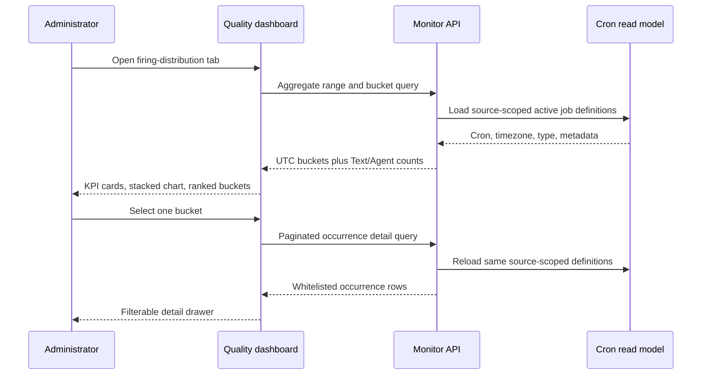
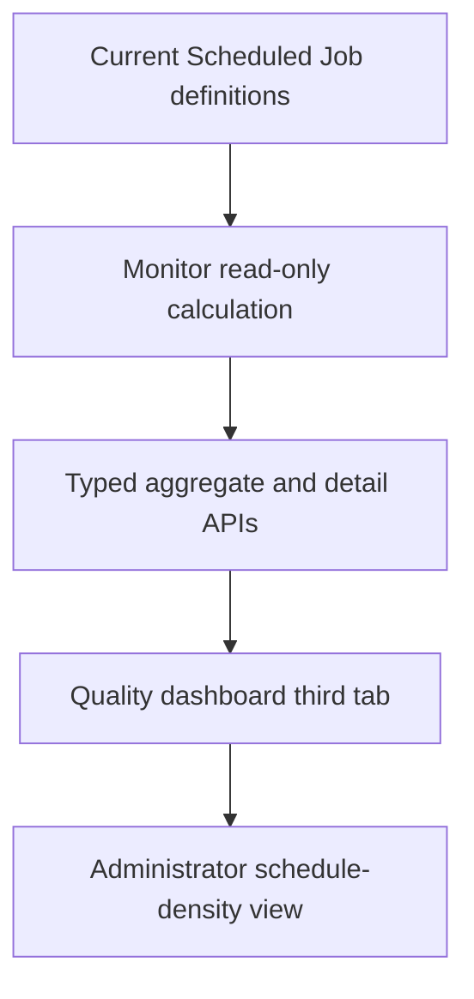

# feat: Add scheduled firing distribution to the quality dashboard

## Summary

Add a third, lazily loaded tab to the existing quality engineering dashboard. Monitor will expand current source-scoped Scheduled Job definitions into planned firing occurrences, aggregate them into selectable time buckets, and serve a separate paginated detail view; the console will render the result with the dashboard's existing Ant Design and ECharts language.

---

## Problem Frame

Administrators can inspect historical Cron execution outcomes, but cannot quickly see when current Scheduled Job definitions concentrate future planned firings. The approved prototype establishes a datetime range, five bucket sizes, Text/Agent separation, and click-through details. The implementation must preserve the distinction between planned schedule density and confirmed queueing or backlog.

---

## Assumptions

*This plan is part of an already-authorized implementation workflow. The items below fill gaps that were not explicitly fixed in the UI prototype and remain reviewable bets.*

- The initial query is a fixed snapshot of the next 24 hours with a 15-minute bucket; it does not slide automatically.
- The first release allows ranges up to seven days and rejects larger or reversed ranges rather than silently truncating them.
- Datetime inputs represent browser-local instants and are sent with an offset; the API normalizes instants to UTC while each cron expression is evaluated in its Scheduled Job IANA timezone.
- Query and bucket boundaries use half-open intervals: start inclusive, end exclusive. Buckets align to the selected start instant and the final bucket may be shorter.
- Batch-dispatch-managed broadcast children do not contribute an independent Scheduled Firing Count when the runtime dispatch-intent feature is enabled; legacy independently scheduled children continue to count.
- Invalid cron expressions and unsupported task types are excluded from counts and reported through bounded diagnostic counts instead of failing the whole request. Invalid timezones follow Scheduler behavior by falling back to UTC while incrementing a diagnostic count.
- Detail rows are planned firing occurrences, so one Scheduled Job may appear more than once in one bucket.
- Aggregate and detail calls recompute from the current Monitor read model. Both responses expose their UTC calculation time. Detail responses also expose a deterministic definition revision; subsequent pages must present the same revision or restart from page one when definitions change.

---

## Requirements

- R1. Add “定时任务触发分布” as the third tab under `/analytics/continuous-governance` without changing the existing dashboard's navigation or visual language.
- R2. Let administrators select start/end datetimes and exactly one of 5, 10, 15, 30, or 60 minutes, then explicitly run the query.
- R3. Count every planned cron occurrence from eligible active, enabled, non-deleted Text or Agent Scheduled Jobs in the current source, excluding runtime-managed broadcast children and definitions with invalid cron expressions or unsupported task types; repeated firings from one job count repeatedly.
- R4. Return and display total, Text, and Agent counts for every bucket and for the whole range, including the peak bucket.
- R5. Let an administrator click a chart bucket or ranked bucket row to open paginated occurrence details, with All/Text/Agent filtering and stable chronological ordering.
- R6. Enforce source isolation in Monitor for both aggregate and detail queries; source is taken only from the trusted request context/header.
- R7. Preserve plan-density semantics throughout labels and contracts. The page must not claim that density proves backlog, queueing, runtime concurrency, or delayed execution.
- R8. Provide loading, zero-data, partial-invalid-data, request-error, responsive, and stale-request states without affecting the two existing quality dashboard tabs.
- R9. Do not return task bodies, request input, session/chat identifiers, or raw metadata in detail responses.

---

## Scope Boundaries

- No database migration, materialized aggregate table, workspace scan, repair, or backfill.
- No confirmed backlog metric; that requires dispatch intent and execution lifecycle data and is separate work.
- No change to Cron ownership, scheduling, retry, callback, or execution behavior.
- No task editing or run-now actions from the distribution detail drawer.
- No new top-level Analytics route or sidebar item.
- No persistent query snapshot in the first release.

### Deferred to Follow-Up Work

- Confirmed backlog and schedule-versus-actual delay analysis using dispatch intent and execution state.
- Persistent or cached aggregation if production volume exceeds the bounded on-demand calculation budget.
- A shared cross-package cron occurrence library if Monitor and Scheduler contract tests later show semantic drift.

---

## Context & Research

### Relevant Code and Patterns

- `console/src/pages/Analytics/ContinuousGovernance/index.tsx` owns the existing two-tab page and its lazy file-governance loading boundary.
- `console/src/pages/Analytics/ContinuousGovernance/index.module.less` defines the page padding, filter bar, KPI cards, panels, and responsive breakpoints to mirror.
- `console/src/pages/Analytics/ContinuousGovernance/index.test.tsx` already verifies tab isolation and provides the integration test harness.
- `console/src/api/modules/monitor.ts` is the typed Monitor client and source-aware request path.
- `console/src/pages/Analytics/BusinessOverview/index.tsx` and the trend-chart design provide the current ECharts conventions.
- `monitor/src/monitor/app/routers/cron.py`, `monitor/src/monitor/app/models/cron.py`, and `monitor/src/monitor/app/services/cron/query_service.py` are the existing source-filtered Cron read-model API stack.
- `scheduler/src/scheduler/app/services/cron/scheduling_service.py` is the current `ZoneInfo` plus `croniter` occurrence-semantics reference.
- `src/swe/app/crons/manager.py` defines batch-dispatch-managed broadcast child metadata and registration behavior.

### User-Confirmed Interaction Constraints

- Do not restore the three explanatory text blocks removed from the approved prototype.
- Keep the datetime fields, interval selector, and query action in one compact desktop filter group; at 820px they may wrap only as needed within that same group.
- Do not add a separate “统计时长” display.
- Chart hover may emphasize the selected bar and show its tooltip, but must not draw an outer blue frame around the chart or plot area.

### Institutional Learnings

- `docs/adr/0003-continuous-governance-reporting-uses-database-read-model.md` requires committed database rows as the reporting authority and forbids request-time workspace scans or repair.
- `docs/adr/0010-independent-cron-scheduling-service-owns-batch-dispatch.md` preserves Scheduler ownership, SWE execution ownership, and Monitor observability/read-model ownership.
- `docs/plans/2026-07-13-001-refactor-cron-scheduler-direct-cutover-plan.md` establishes UTC scheduled-fire identity and job-timezone cron evaluation.
- `docs/superpowers/plans/2026-07-23-cron-batch-list-filter-pagination.md` requires server-side pagination, stable filtering, and protection from stale responses.
- `CONTEXT.md` defines Scheduled Firing Count as plan density rather than execution or backlog.
- The repository currently has no `docs/solutions/` directory.

### External References

- None. Current repository patterns and Scheduler behavior are sufficient for this implementation.

---

## Key Technical Decisions

- Use the Monitor database read model rather than execution history: the question is what current definitions plan to fire, not what already executed.
- Add separate aggregate and detail endpoints: the chart response remains bounded, while details are fetched only after a bucket is selected.
- Evaluate five-field cron expressions using `croniter` in the job timezone and normalize each occurrence to UTC before bucket assignment.
- Stream aggregate occurrences into counters and enforce a hard calculation budget; never return a partial response that looks complete.
- Return dedicated whitelist DTOs for the drawer rather than reusing the broad `CronJobModel`.
- Exclude only managed broadcast children identified by the runtime dispatch-intent feature flag plus both parent metadata and per-job dispatch-intent enablement; keep the managed parent and legacy independently scheduled children.
- Put the new UI in an isolated child component with its own request, error, selected-bucket, drawer, and pagination state; `ContinuousGovernancePage` only adds the tab and lazy mount boundary.
- Use a stacked ECharts bar chart with Text/Agent series, ordinary tooltip emphasis, no outer hover/selection frame, and a ranked table derived from the same aggregate response.

---

## Open Questions

### Resolved During Planning

- **Does a count represent unique jobs or planned occurrences?** Planned occurrences; one job may contribute multiple times.
- **Does planned density prove backlog?** No. The canonical metric explicitly excludes that inference.
- **Which source owns filtering?** Monitor applies the trusted source boundary to every query.
- **How are interval boundaries handled?** `[start, end)` for both the range and each bucket.
- **How are managed broadcast children treated?** They are excluded as independent timers to avoid duplicate physical-fire counts.
- **What detail fields are safe?** Time, job identity/name, type, cron, and timezone only.

### Deferred to Implementation

- Exact bounded occurrence budget and error status: choose a value from characterization tests that prevents pathological CPU/memory use without rejecting the expected seven-day workload.
- Exact ECharts label density at very high bucket counts: tune during browser verification while preserving all data and tooltip access.

---

## High-Level Technical Design

> *This illustrates the intended approach and is directional guidance for review, not implementation specification. The implementing agent should treat it as context, not code to reproduce.*

---

## Implementation Units

### U1. Define and test the Monitor schedule calculation contract

**Goal:** Establish the response models, cron occurrence rules, source-scoped job selection, broadcast-child exclusion, and calculation limits.

**Requirements:** R3, R4, R6, R7, R9

**Dependencies:** None

**Files:**
- Modify: `monitor/pyproject.toml`
- Modify: `monitor/src/monitor/app/models/cron.py`
- Modify: `monitor/src/monitor/app/services/cron/query_service.py`
- Create/Test: `monitor/tests/test_cron_schedule_distribution.py`

**Approach:**
- Add the Monitor package's explicit `croniter` dependency.
- Add aggregate bucket/response and whitelist occurrence models.
- Load only active, enabled, non-deleted jobs for the trusted source.
- Parse metadata only to distinguish managed broadcast children; never return raw metadata.
- Match the runtime-managed child predicate, including `SWE_CRON_DISPATCH_INTENTS_ENABLED`, so an environment switch cannot silently change the physical-timer count.
- Calculate in job timezone, normalize to UTC, assign to start-aligned half-open buckets, and report invalid/unsupported definitions. Invalid timezones fall back to UTC and remain counted, matching Scheduler.
- Share one internal occurrence generator between aggregate and detail paths so counts reconcile.
- Include `calculated_at` on aggregate and detail responses. Compute a deterministic revision from the eligible definition fields used for the detail result.
- Enforce a hard limit of 100,000 generated occurrences per request and fail with a typed `schedule_calculation_limit_exceeded` client error instead of returning partial data.

**Execution note:** Implement test-first, beginning with failing service tests for boundary, timezone, type, source, and broadcast behavior.

**Patterns to follow:**
- Source-aware clauses and database access in `QueryService`.
- `ZoneInfo` and `croniter` semantics in Scheduler.
- Existing Pydantic Cron response models.

**Test scenarios:**
- Happy path: Text and Agent jobs with multiple firings produce conserving bucket and range totals.
- Edge case: a firing at range start counts, a firing at range end does not, and a bucket-boundary firing enters only the right bucket.
- Edge case: 5/10/15/30/60-minute buckets and a partial final bucket are emitted correctly.
- Edge case: UTC, Asia/Shanghai, and a DST-observing timezone map local cron times to the expected UTC instants.
- Edge case: active-disabled, paused-enabled, deleted, and soft-deleted jobs are excluded.
- Edge case: managed broadcast children are excluded only when the runtime and per-job dispatch-intent gates are enabled, while their parent and legacy independent children remain eligible.
- Error path: invalid cron, metadata, or task type leaves valid jobs intact and increments bounded diagnostics; an invalid timezone falls back to UTC and increments its own diagnostic.
- Error path: reversed, zero-length, over-seven-day, or over-budget calculations fail without partial data.
- Integration: the generated detail occurrence count reconciles with the selected aggregate bucket.
- Integration: aggregate and detail serialize UTC calculation timestamps, and a changed definition revision rejects a subsequent detail page so the client can restart safely.

**Verification:**
- Service tests prove deterministic counts, ordering, isolation predicates, and error semantics without changing existing Cron query results.

### U2. Expose source-safe aggregate and detail endpoints

**Goal:** Add validated HTTP contracts for the aggregate chart and paginated occurrence drawer.

**Requirements:** R2, R3, R4, R5, R6, R9

**Dependencies:** U1

**Files:**
- Modify: `monitor/src/monitor/app/routers/cron.py`
- Test: `monitor/tests/test_cron_schedule_distribution.py`

**Approach:**
- Add one aggregate endpoint and one paginated detail endpoint under the existing Monitor Cron router.
- Accept offset-aware datetimes, the bucket whitelist, optional Text/Agent detail filter, and bounded pagination.
- Resolve source exclusively from the existing trusted header path.
- Convert domain validation failures into clear client errors while preserving unexpected failures.
- Sort details by `(scheduled_fire_at_utc, job_id)` ascending and require the first-page definition revision on subsequent pages.

**Execution note:** Start with failing FastAPI contract tests before wiring the service.

**Patterns to follow:**
- Existing Cron router dependency injection and `X-Source-Id` handling.
- TestClient dependency override pattern in Monitor tests.

**Test scenarios:**
- Happy path: source header, range, bucket, pagination, and task filter reach the service and serialize typed responses.
- Happy path: aggregate/detail responses include `calculated_at`, and detail responses include the definition revision.
- Error path: invalid interval, range, missing offset, task type, page, or page size returns a client validation error.
- Error path: a stale detail revision returns a client conflict response that instructs the caller to restart at page one.
- Security boundary: a query parameter cannot override the trusted source header.
- Compatibility: existing `/overview`, `/jobs`, and `/executions` routes retain their contracts.

**Verification:**
- API tests demonstrate stable JSON contracts and source isolation for both endpoints.

### U3. Add the typed client and isolated distribution panel

**Goal:** Build the dashboard-native filter, KPI, chart, ranking, error/empty states, and detail drawer as an independently testable component.

**Requirements:** R1, R2, R4, R5, R7, R8, R9

**Dependencies:** U2

**Files:**
- Modify: `console/src/api/modules/monitor.ts`
- Create: `console/src/pages/Analytics/ContinuousGovernance/CronScheduleDistribution/index.tsx`
- Create: `console/src/pages/Analytics/ContinuousGovernance/CronScheduleDistribution/index.module.less`
- Create/Test: `console/src/pages/Analytics/ContinuousGovernance/CronScheduleDistribution/index.test.tsx`

**Approach:**
- Add typed aggregate/detail client calls using the shared Monitor request path.
- Reuse the existing page's spacing, borders, typography, filter controls, KPI cards, table sizing, and breakpoints.
- Render a stacked Text/Agent ECharts bar chart and a top-bucket table from one response; both open the same drawer.
- Keep editable filters separate from the applied-query snapshot. Results, chart selections, and detail requests stay bound to the applied snapshot until a new query succeeds; a successful new query clears the selected bucket and drawer.
- Validate incomplete, reversed, zero-length, and over-seven-day ranges before requesting. Show compact inline feedback at the responsible control and map matching API validation errors to the same state.
- Fetch details only after selection, reset page/type state when the bucket/query changes, send the returned definition revision on later pages, and restart at page one if the service reports that definitions changed.
- Keep partial-invalid diagnostics visible but compact and only when present; do not add an explanatory banner or a separate query-duration block. Distinguish request failure from a legitimate zero result.
- Give every ranked bucket row a focusable, labelled details action. The drawer has a bucket-specific accessible title and restores focus to the invoking control when closed.

**Execution note:** Implement component behavior test-first with mocked Monitor calls and an ECharts test double.

**Patterns to follow:**
- Continuous Governance filter, panel, table, and responsive styling.
- Existing ECharts option construction and resize behavior in Analytics.
- Existing Ant Design Drawer and Table pagination patterns.

**Test scenarios:**
- Happy path: default first load sends the next-24-hour range and 15-minute bucket and renders total/Text/Agent/peak summaries.
- Happy path: all five intervals and a changed datetime range are sent only after Query is selected.
- Happy path: selecting a chart bucket or ranked row loads the correct half-open detail range and opens the drawer.
- Happy path: All/Text/Agent drawer filtering resets pagination and calls the server with the selected type.
- Happy path: editing filters does not relabel existing results or details until Query succeeds.
- Edge case: repeated occurrences from one job render as separate detail rows.
- Edge case: zero eligible jobs, zero firings, and partially invalid jobs have distinct, truthful states.
- Error path: aggregate failure preserves filters and offers retry; detail failure leaves the drawer open.
- Race path: a stale aggregate or detail response cannot overwrite a newer query/selection.
- Race path: a changed detail definition revision restarts from page one instead of mixing pages.
- Accessibility/visual contract: chart has a textual summary, legend and tooltip labels identify Text/Agent, the ranked-row detail action works from the keyboard, focus moves into and returns from the drawer, and hover adds no outer blue frame.

**Verification:**
- Component tests prove filter, chart-selection, drawer, pagination, diagnostics, error, and stale-response behavior.

### U4. Integrate the third lazy tab and verify the production surface

**Goal:** Attach the panel to the current quality dashboard without changing existing tabs, route behavior, or page style.

**Requirements:** R1, R8

**Dependencies:** U3

**Files:**
- Modify: `console/src/pages/Analytics/ContinuousGovernance/index.tsx`
- Modify: `console/src/pages/Analytics/ContinuousGovernance/index.test.tsx`
- Modify: `console/src/pages/Analytics/ContinuousGovernance/index.module.less` only if shared tab-level layout needs a small adjustment

**Approach:**
- Extend the existing tab key union and items with the isolated panel.
- Preserve independent loading/error state so opening the new tab does not request or disturb governance/archive data.
- Run production build and browser verification at desktop and narrow widths against the user-confirmed interaction constraints in this plan.

**Execution note:** Add a failing page integration test for lazy mounting and tab failure isolation before changing the tab list.

**Patterns to follow:**
- Existing file-governance lazy-load behavior and integration tests.

**Test scenarios:**
- Happy path: the new tab is present, mounts on first selection, and remains under the existing route.
- Isolation: the new Monitor request does not run while either existing tab is active.
- Regression: governance and file tabs retain their labels, data calls, and error behavior.
- Responsive browser: 1440×900 keeps the datetime fields, interval selector, and Query action in one compact group; 820×900 wraps minimally within the same group while preserving a readable chart, cards, table, and drawer.
- Interaction browser: chart tooltip has no outer blue frame and chart/table clicks open matching details.

**Verification:**
- Targeted frontend tests, typecheck/build, and browser screenshots demonstrate a visually consistent production page.

---

## System-Wide Impact

- **Interaction graph:** The new console panel calls two additive Monitor endpoints; neither endpoint invokes Scheduler or SWE.
- **Error propagation:** Definition-level parse errors become bounded diagnostics; request validation becomes client errors; database or calculation-budget failures become explicit request failures, never false zeroes.
- **State lifecycle risks:** Job definitions may change between aggregate and detail calls. Calculation timestamps make that current-state behavior visible; persistent snapshots are deferred.
- **API surface parity:** Existing Cron overview, job, execution, export, and Scheduler contracts remain unchanged.
- **Integration coverage:** FastAPI contract tests plus the console integration test cover the HTTP seam; browser verification covers ECharts and responsive behavior.
- **Unchanged invariants:** Monitor remains read-only for this flow, trusted source isolation stays server-side, and plan density is never promoted to backlog truth.

---

## Risks & Dependencies

| Risk | Mitigation |
|---|---|
| On-demand cron expansion becomes expensive | Seven-day range, explicit occurrence budget, streaming aggregate counters, separate short-bucket detail query, and no partial success |
| Monitor and Scheduler cron semantics drift | Follow Scheduler's `ZoneInfo`/`croniter` behavior and add timezone/boundary contract tests; defer a shared library until drift is demonstrated |
| Broadcast children inflate counts | Match the runtime feature gate plus parent and per-job dispatch-intent metadata; cover managed and legacy modes |
| Invalid definitions create deceptively low counts | Return bounded diagnostics and show compact inline feedback only when present; invalid timezones follow Scheduler's UTC fallback |
| Cross-source data leakage | Apply source in the service query for aggregate and detail; do not accept source as a query filter |
| Stale UI responses overwrite newer selections | Use request identity or cancellation for aggregate and detail calls and test race ordering |
| Visual mismatch with current dashboard | Reuse existing Ant Design/ECharts patterns and CSS tokens; verify at the two approved viewport sizes |
| Detail payload leaks task content | Dedicated whitelist DTO and frontend type; no broad CronJobModel reuse |

---

## Documentation / Operational Notes

- `CONTEXT.md` records the canonical Scheduled Firing Count semantics.
- No ADR is required: the work follows existing Monitor read-model and Scheduler ownership decisions rather than introducing a hard-to-reverse architecture.
- Operators should treat invalid-definition diagnostics as data-quality work, not as zero-demand periods.

---

## Sources & References

- `CONTEXT.md`
- `docs/adr/0003-continuous-governance-reporting-uses-database-read-model.md`
- `docs/adr/0010-independent-cron-scheduling-service-owns-batch-dispatch.md`
- `docs/plans/2026-07-13-001-refactor-cron-scheduler-direct-cutover-plan.md`
- `docs/superpowers/specs/2026-06-30-trend-chart-enhancement-design.md`
- `docs/superpowers/plans/2026-07-23-cron-batch-list-filter-pagination.md`
- `console/src/pages/Analytics/ContinuousGovernance/index.tsx`
- `console/src/api/modules/monitor.ts`
- `monitor/src/monitor/app/routers/cron.py`
- `monitor/src/monitor/app/services/cron/query_service.py`
- `scheduler/src/scheduler/app/services/cron/scheduling_service.py`
