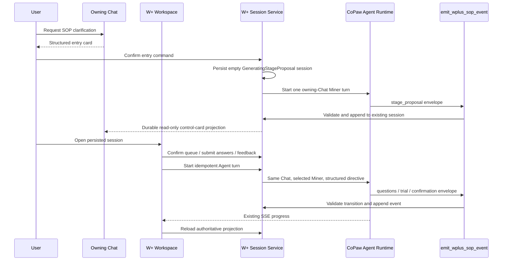
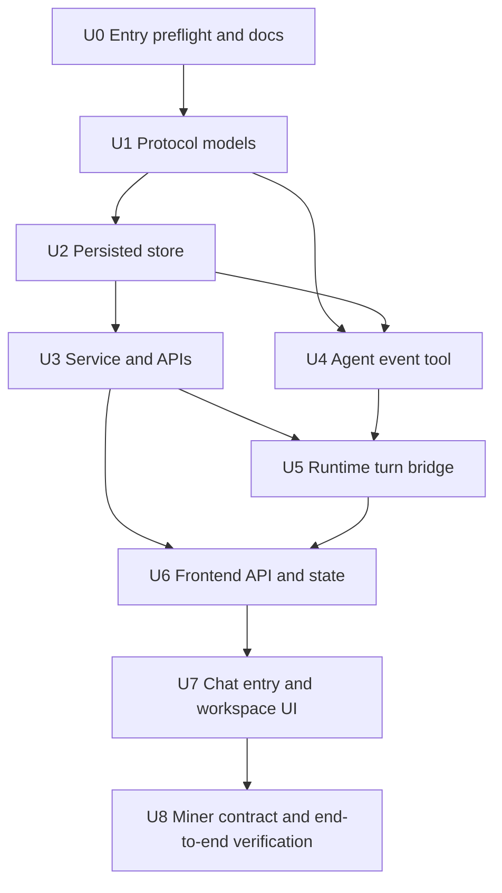
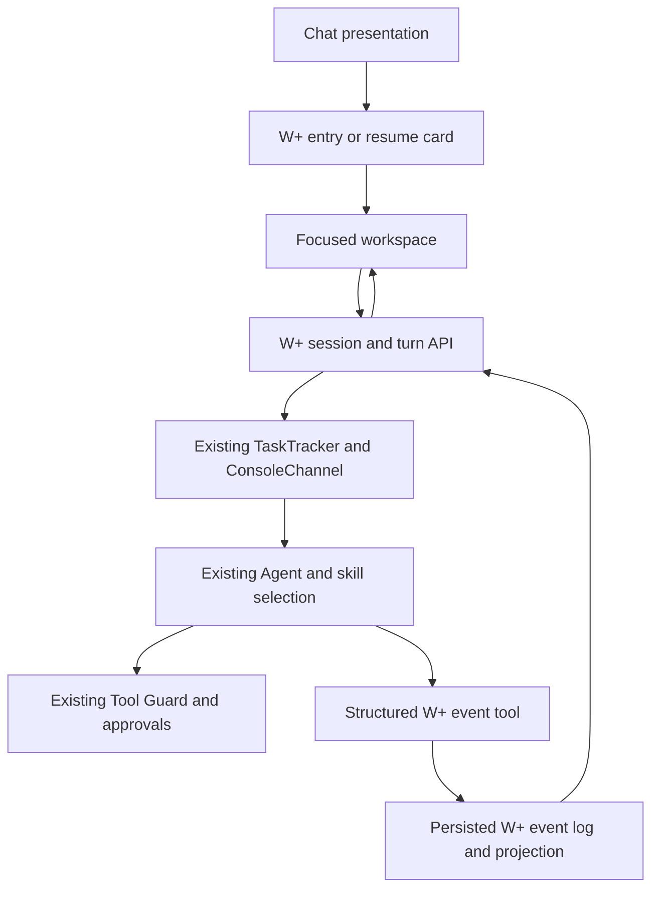

# W+ SOP Workspace V1 production implementation

## Summary

Implement a persisted W+ SOP clarification workspace as a specialized view of
the owning Chat. The Miner continues to run through CoPaw's existing Agent,
tool-guard, approval, chat-history, and SSE pipeline; a new structured event
tool and session control layer make its stage proposal, questions, system-run
trial, feedback loop, exit, and recovery deterministic and renderable outside
Markdown.

---

## Problem Frame

The approved prototype exposes two production gaps: users need one explicit
place to answer questions and review system-run pre-runs, and Chat needs a
visible, recoverable way to enter that workspace. The current Miner contract
still asks users to execute pre-runs themselves and emits presentation text
rather than a persisted protocol, so a UI-only implementation would not be a
real workflow.

---

## Requirements

- R1. A W+ SOP clarification session is persisted by the backend, owned by one
  tenant/source/user/agent and one persisted Chat record, with at most one
  active or paused session per Chat.
- R2. The first Miner turn emits only a 2–4-stage proposal; questions are not
  emitted until the queue is confirmed or adjusted.
- R3. The workspace at `/wplus-sop/:sessionId` is the sole answer and feedback
  entry surface. Chat shows read-only entry, progress, completion, and resume
  projections.
- R4. Miner outputs arrive through a versioned Structured Interaction Envelope
  with stable event, stage, question, and option IDs; browser code never
  derives controls by parsing Markdown.
- R5. Queue confirmation, answer batches, feedback, retry, stage confirmation,
  save-and-exit, resume, and termination use optimistic state versions and
  idempotency request IDs.
- R6. System-run pre-runs execute through the owning Chat's existing CoPaw
  Agent/runtime. Tool Guard and approval behavior remain unchanged for
  side-effectful operations.
- R7. Refresh, repeated clicks, SSE reconnects, and duplicate request IDs do
  not create duplicate Agent turns, events, answers, trials, or Chat records.
- R8. Navigation alone does not pause a session. Explicit save-and-exit during
  generation records `PendingExit` and pauses only after the current durable
  event is committed.
- R9. Revisions append an audit event and invalidate downstream answers,
  results, confirmations, and pending memory choices.
- R10. Completion requires memory candidates to be approved/rejected or
  explicitly skipped. V1 does not auto-run `wplus-skill-builder`.
- R11. Original customer values and raw tool responses stay in the existing
  controlled backend/runtime path; W+ state and browser payloads contain only
  workflow structure and redacted summaries.
- R12. Explicit and implicit invocation both render an entry card before any
  Session or Miner turn exists. Confirm creates the empty persisted Session
  first; implicit reject creates no Session and returns the original request to
  ordinary Chat exactly once.
- R13. The W+ event log and a persistent Chat-projection outbox share one commit
  point. Projection retry and restart reconciliation are idempotent.
- R14. Every read, write, stream, lookup, and download fails closed unless the
  tenant/source/user/agent/chat ownership tuple matches.

**Origin actors:** SOP author, CoPaw Agent, W+ SOP Miner

**Origin flows:** Chat entry, stage queue confirmation, clarification,
system-run trial, feedback/retry, stage confirmation, save/exit/resume,
completion

---

## Scope Boundaries

- Do not create a second Chat, second Agent loop, or browser-side W+/OpenCLI/MCP
  executor.
- Do not infer skill authority from visible `@skill` text or Markdown; preserve
  the existing structured `selected_skill_names` path.
- Do not add automatic PII discovery or claim stronger redaction than existing
  runtime sanitization plus the Miner's minimum-data contract.
- Do not invoke the skill builder automatically.
- Do not replace the existing general-purpose Chat UI.
- Do not make the W+ workspace a permanent sidebar destination in V1; entry is
  contextual from the owning Chat.

---

## Context & Research

### Relevant Code and Patterns

- `src/swe/app/routers/console.py`: authoritative console Agent turn and SSE
  attach/reconnect path.
- `src/swe/app/runner/runner.py`: creates the Agent request context and uses the
  persisted Chat record ID as the task-progress ownership key.
- `src/swe/agents/react_agent.py`: registers built-in tools and binds tool
  context for the current Chat turn.
- `src/swe/agents/tools/update_task_progress.py`: context-aware hidden tool
  pattern.
- `src/swe/app/runner/repo/json_repo.py`: atomic local JSON persistence pattern.
- `console/src/components/agentscope-chat/AgentScopeRuntimeWebUI/core/Chat/hooks/useChatRequest.tsx`:
  converts SSE metadata into Chat cards.
- `console/src/pages/Chat/index.tsx`: card renderer registration and active Chat
  identity.
- `console/src/layouts/MainLayout/index.tsx`: application route registration.

### Institutional Learnings

- Logical Chat session ID, persisted Chat record ID, and W+ SOP session ID are
  distinct identities and must have distinct field names.
- Reconnect attaches to an existing owner/run; it must not recreate work.
- Visible skill labels are presentation, not authority.
- The existing `SafeJSONSession` lock is process-local. V1 uses an isolated,
  atomic W+ store with optimistic versions and documents that cross-process
  deployment requires the database-backed store adapter.

---

## Key Technical Decisions

| Decision | Rationale |
|---|---|
| Add a hidden `emit_wplus_sop_event` Agent tool | The Miner can commit typed UI state without Markdown parsing, while remaining in the real Agent/tool runtime. |
| Store one append-only event log plus a current projection | Events preserve revision/idempotency audit; the projection keeps reads and rendering simple. |
| Create the empty Session before starting Miner | Entry confirmation has a durable failure/recovery target; the hidden tool only appends events and can never create the first Session. |
| Store Chat projections in a persistent outbox beside each W+ event | A Chat write can be retried or reconciled after restart without losing or duplicating the authoritative W+ transition. |
| Bind sessions to persisted `chat_id` | It is the stable Chat record and the existing task tracker/SSE ownership key. |
| Run workspace turns through a W+ endpoint that delegates to ConsoleChannel/TaskTracker | Reuses the same Agent, history, approvals, stop, and reconnect behavior without exposing execution to the browser. |
| Keep Chat cards read-only and make workspace actions API writes | Preserves one answer surface and prevents Chat/workspace divergence. |
| Use server-generated `state_version` and validate client `expected_state_version` | Prevents stale tabs and repeated actions from overwriting newer state. |
| Separate command idempotency from run attempts | A stable `command_request_id` deduplicates network retries; each real retry or feedback rerun gets a new run/attempt linked to its predecessor. |

---

## Open Questions

### Resolved During Planning

- **Where is pre-run executed?** In the existing CoPaw backend Agent/tool
  runtime, initiated by the workspace turn endpoint.
- **How does Chat enter the workspace?** Explicit selection or implicit
  detection first returns a structured entry proposal. Confirming it
  idempotently creates `GeneratingStageProposal`, starts one same-Chat Miner
  turn, and turns the card into the durable session control card. Active-session
  lookup renders the same resume action after refresh.
- **How are object-list outputs rendered?** The envelope carries typed arrays
  such as stages, questions/options, result columns/rows, findings, and memory
  candidates; the page maps those objects directly to components.
- **What happens when an Agent response omits the W+ tool call?** The run becomes
  a recoverable failure and the workspace offers retry; it never parses prose
  into controls.
- **What queue edits exist in V1?** Add, rename, reorder, and delete. The entire
  queue is submitted atomically and must contain 2–4 non-empty, uniquely named
  stages with stable unique IDs.
- **What is recovery truth?** Persisted Session projection. SSE events are
  hints; duplicate/old versions are ignored and a version gap forces a GET.
- **What is the deployment boundary?** W+ JSON writes are enabled only in the
  local single-process desktop runtime. Multi-worker deployments require the
  database store adapter.

### Deferred to Implementation

- A database-backed multi-instance store adapter is a deployment follow-up;
  the local product path uses atomic workspace storage and optimistic versions.

---

## Output Structure

    src/swe/app/wplus_sop/
      __init__.py
      models.py
      store.py
      service.py
      runtime.py
      router.py
    src/swe/agents/tools/
      emit_wplus_sop_event.py
    console/src/api/
      types/wplusSop.ts
      modules/wplusSop.ts
    console/src/pages/
      WPlusSopWorkspace/
      Chat/components/WPlusSopSessionCard/

---

## High-Level Technical Design



The authoritative state sequence is:

```text
GeneratingStageProposal -> AwaitingQueueConfirmation
-> GeneratingQuestions -> AwaitingAnswer
-> GeneratingTrial -> ExecutingTrial -> AwaitingTrialFeedback
-> AwaitingStageConfirmation -> (GeneratingQuestions for next stage
   | FinalizingOutputs)
-> MemoryReview
-> Completed
```

`PendingExit`, `Paused`, `RecoverableFailure`, `Terminated`, and revision
invalidation are explicit transitions, not UI-only flags.

### Command and transition contracts

| Current state | Command or event | Success state | Starts Agent/run |
|---|---|---|---|
| no Session | `confirm_entry` | `GeneratingStageProposal` | one initial Miner run |
| `GeneratingStageProposal` | `stage_proposal` | `AwaitingQueueConfirmation` | no |
| `AwaitingQueueConfirmation` | `confirm_stage_queue` | `GeneratingQuestions` | one Miner run |
| `GeneratingQuestions` | `question_batch` | `AwaitingAnswer` | no |
| `AwaitingAnswer` | `submit_answers` | `GeneratingTrial` | one Miner run |
| `GeneratingTrial` | `trial_plan` | `ExecutingTrial` | same claimed run |
| `ExecutingTrial` | `trial_execution_completed` | `AwaitingTrialFeedback` | no |
| `AwaitingTrialFeedback` | `submit_trial_feedback` | `GeneratingTrial` | new run with `rerun_of_run_id` |
| `AwaitingTrialFeedback` | `accept_trial` | `AwaitingStageConfirmation` | no |
| `AwaitingStageConfirmation` | `confirm_stage` | `GeneratingQuestions` or `FinalizingOutputs` | one Miner run |
| `FinalizingOutputs` | valid `sop_result` plus `memory_candidates` | `MemoryReview` | no |
| `MemoryReview` | `resolve_memory` or zero candidates | `MemoryReview` or `Completed` | no |

All commands require a stable `command_request_id`. A command receipt records
whether it starts work and the resulting `run_id`/`attempt_id`. A real retry
uses a new command ID and attempt with `retry_of_run_id`; repeating that retry's
same command ID returns its original receipt.

Auxiliary transitions are:

| Current state | Command or event | Success state | Starts Agent/run |
|---|---|---|---|
| any stable waiting state | `save_and_exit` | `Paused` with `resume_state` | no |
| any generating/executing state | `save_and_exit` | `PendingExit`, then `Paused` after durable run boundary | no new run |
| `Paused` | `resume` | recorded `resume_state` | only if the recorded state is a generating point |
| `RecoverableFailure` | `retry_current_turn` | failed operation's generating state | new attempt with `retry_of_run_id` |
| editable active state | `revise_answer` | earliest invalidated generating state | one new Miner run |
| any non-terminal state | `terminate` | `Terminated`, or `PendingExit` then `Terminated` during execution | no new run |
| timed-out `PendingExit` | `cancel_run_and_pause` | `Paused` at last stable state | cancels original run |
| `PendingExit` | `continue_waiting` | `PendingExit` | no |

Concurrent exit decisions are first-writer-wins under `expected_state_version`.
Cancelling a run never skips Tool Guard approval or pretends an unconfirmed
side effect was rolled back.

Illegal transitions are non-mutating. HTTP errors use: 400 malformed schema,
404 missing identity or inaccessible ownership, 409 state/version conflict,
422 illegal transition, and 429/503 retryable runtime capacity/failure. A 409
response includes the current projection while the frontend retains any local
unsubmitted answer or feedback draft.

---

## Implementation Units



### U0. Entry preflight and aligned contract

**Goal:** Produce the Chat entry proposal before Agent execution and align the
ADR, product spec, glossary, and Miner first-turn contract.

**Files:**
- Create: `src/swe/app/wplus_sop/entry.py`
- Modify: `src/swe/app/routers/console.py`
- Modify: `docs/adr/0013-wplus-sop-uses-persisted-session-and-structured-envelope.md`
- Modify: `docs/superpowers/specs/2026-07-17-wplus-sop-workspace-design.md`
- Modify: `CONTEXT.md`
- Test: `tests/unit/app/test_console_wplus_sop_entry.py`

**Test scenarios:**
- Explicit and implicit invocation both return an entry proposal without a
  Session or Agent run.
- Implicit reject creates no Session and ordinary Chat handles the original
  request exactly once with Miner re-detection suppressed.
- Duplicate confirmation creates one empty Session and one initial run.

**Approach:**
- Run entry classification in `post_console_chat` after trusted
  `selected_skill_names`, identity, and workspace are resolved but before
  `_start_new_chat` or `TaskTracker.attach_or_start`.
- Explicit authority is the server-resolved `selected_skill_names` value.
  Implicit classification reuses `SkillInvocationDetector`'s synchronous
  message-level inference with the workspace's effective enabled skills and
  requires an exact `wplus-sop-miner` result at the configured confidence
  threshold. It does not start an Agent or confirm a skill association.
- Return a structured terminal SSE entry proposal for that Chat request. A
  rejection replay carries a server-issued one-turn suppression token bound to
  source/user/agent/logical-session/original-message digest; the original
  request then passes through ordinary Chat exactly once.
- If the classifier is unavailable or below threshold, fall back to ordinary
  Chat. Never infer authority from visible `@skill` Markdown.

### U1. Structured protocol and state machine

**Goal:** Define the server-owned W+ identities, events, typed object-list
payloads, and legal transitions.

**Requirements:** R1, R2, R4, R5, R8, R9, R10, R11

**Dependencies:** None

**Files:**
- Create: `src/swe/app/wplus_sop/models.py`
- Test: `tests/unit/app/wplus_sop/test_models.py`

**Approach:**
- Use Pydantic discriminated event payloads.
- Keep `chat_id`, `logical_chat_session_id`, and `sop_session_id` distinct.
- Generate protocol/event/state versions server-side.

**Execution note:** Test-first.

**Test scenarios:**
- Happy path: valid stage proposal with 2–4 stable stage objects validates.
- Edge case: object-list result rows remain JSON objects without flattening.
- Error path: invalid kind/state transition or missing stable ID is rejected.
- Error path: customer/raw-response fields are rejected from persisted trial
  summaries.

**Verification:**
- Model tests prove the protocol surface and state machine.

### U2. Atomic persisted session store

**Goal:** Persist sessions, projections, event history, idempotency receipts,
active-run claims, run lineage, Chat-projection outbox, and revision
invalidations per Agent workspace.

**Requirements:** R1, R5, R7, R8, R9

**Dependencies:** U1

**Files:**
- Create: `src/swe/app/wplus_sop/store.py`
- Test: `tests/unit/app/wplus_sop/test_store.py`

**Approach:**
- Use one atomic JSON repository under the resolved Agent workspace.
- Serialize writes with a path lock, write a temp file, fsync, and replace.
- Enforce one active/paused session per persisted Chat.
- Cache idempotent command results by request ID.
- Commit each event and deterministic Chat outbox item in the same atomic file
  replacement; acknowledge projection delivery only after the Chat write.
- Refuse W+ writes when configured for a multi-worker process layout.

**Execution note:** Test-first, including concurrent tasks.

**Test scenarios:**
- Happy path: create, reload, and query active session by Chat.
- Edge case: duplicate request ID returns the original result.
- Error path: stale state version is rejected.
- Integration: concurrent create attempts produce one active session.
- Recovery: a failed Chat write remains in the outbox; a new store/service
  instance replays it exactly once by projection event ID.

**Verification:**
- Reopening a new store instance reconstructs the same projection and events.

### U3. Ownership-aware service and HTTP API

**Goal:** Expose safe reads and state commands to Chat and workspace clients.

**Requirements:** R1, R3, R5, R8, R9, R10

**Dependencies:** U2

**Files:**
- Create: `src/swe/app/wplus_sop/service.py`
- Create: `src/swe/app/wplus_sop/router.py`
- Create: `src/swe/app/wplus_sop/chat_guard.py`
- Create: `src/swe/app/wplus_sop/outbox.py`
- Modify: `src/swe/app/routers/__init__.py`
- Modify: `src/swe/app/routers/agent_scoped.py`
- Modify: `src/swe/app/routers/console.py`
- Test: `tests/unit/app/wplus_sop/test_router.py`

**Approach:**
- Resolve the current Agent workspace and trusted request identity.
- Verify the Chat exists and belongs to the requesting user before every read
  or write.
- Require `expected_state_version` and `request_id` for mutations.
- Require the full tenant/source/user/agent/chat ownership tuple for reads,
  commands, active lookup, streams, and downloads; return 404 on mismatch.
- The entry-confirm command creates the empty Session before the initial run is
  claimed. Session creation and duplicate confirmation are idempotent.
- Before any ordinary non-reconnect Chat start, `post_console_chat` invokes the
  authoritative active-session guard. Active and `PendingExit` sessions reject
  direct/stale-tab Chat writes; paused, completed, and terminated sessions
  permit ordinary Chat.
- `outbox.py` owns deterministic Chat projection delivery, projection event ID
  deduplication, ack, and startup/request-time reconciliation through a narrow
  Chat-history adapter. Every W+ read/command opportunistically drains bounded
  pending items; application startup performs the same bounded reconciliation.

**Test scenarios:**
- Happy path: owner confirms entry, then reads/updates the bound session.
- Error path: wrong user/source/agent, missing context, wrong Chat, or stale
  version fails closed.
- Edge case: refresh lookup returns the active/paused session without mutation.
- Edge case: full stage queue add/rename/reorder/delete succeeds only when the
  submitted array remains 2–4 non-empty unique stages with stable IDs.
- Error path: direct ordinary Chat submission is rejected while active but is
  accepted after pause/completion/termination.
- Recovery: injected Chat write failure leaves one pending outbox item; restart
  or the next request writes one projection and acknowledges it by projection
  event ID.

**Verification:**
- Router tests assert status codes and no partial writes on rejection.

### U4. Structured Miner event tool

**Goal:** Let the active Miner commit structured envelopes from inside the real
Agent turn.

**Requirements:** R2, R4, R6, R9, R11

**Dependencies:** U1, U2

**Files:**
- Create: `src/swe/agents/tools/emit_wplus_sop_event.py`
- Modify: `src/swe/agents/tools/__init__.py`
- Modify: `src/swe/agents/react_agent.py`
- Modify: `src/swe/config/config.py`
- Modify: `src/swe/config/context.py`
- Test: `tests/unit/agents/tools/test_emit_wplus_sop_event.py`

**Approach:**
- Register a hidden built-in tool.
- Read trusted tenant/source/user/workspace/Chat context from context variables.
- Fail closed outside a persisted Chat turn.
- Return a compact read-only workspace action for SSE projection.
- Look up an existing Session and append only; the tool must never create the
  first Session.

**Test scenarios:**
- Happy path: first stage proposal updates the pre-created Session and returns
  its route.
- Error path: a stage proposal without a pre-created Session makes no write.
- Error path: missing identity or Chat context makes no write.
- Error path: invalid transition/event payload makes no write.

**Verification:**
- Tool tests prove that browser input cannot choose another tenant/user/Chat.

### U5. Idempotent Agent turn and SSE bridge

**Goal:** Start or reconnect workspace turns through the owning Chat's existing
Agent, history, Tool Guard, approvals, and TaskTracker.

**Requirements:** R3, R5, R6, R7, R8

**Dependencies:** U3, U4

**Files:**
- Modify: `src/swe/app/wplus_sop/router.py`
- Create: `src/swe/app/wplus_sop/runtime.py`
- Modify: `src/swe/app/routers/console.py`
- Modify: `src/swe/app/channels/console/channel.py`
- Test: `tests/unit/app/wplus_sop/test_turn_stream.py`
- Test: `tests/unit/app/test_console_wplus_sop_action.py`

**Approach:**
- Claim one run before starting work.
- Give each execution a new `run_id`/`attempt_id`, retaining retry/rerun lineage;
  use command receipts to deduplicate repeated starts.
- Reuse ConsoleChannel and TaskTracker rather than invoking tools directly.
- Attach live status metadata for an existing Session to SSE after a successful
  tool commit. This metadata never creates the entry card or replaces the
  persisted control/audit projection.
- On disconnect, let the existing background run continue; reconnect attaches
  by stored run/Chat identity.
- If a completed Agent turn emitted no valid W+ event, persist a recoverable
  failure.
- Treat TaskTracker SSE as live transport only. On process restart, reconcile
  an `ExecutingTrial` claim to the original run outcome or
  `RecoverableFailure`; never silently launch another trial.
- Extract one internal `start_console_chat_turn` service used by both the
  ordinary console route and W+ command bridge. Its trusted input includes the
  ownership tuple, persisted `chat_id`, logical Chat session ID, original or
  structured W+ content parts, server-resolved Miner selection,
  `command_request_id`, and run/attempt IDs. It owns message ID creation, Chat
  persistence, TaskTracker attach/start, ConsoleChannel streaming, and
  reconnect output so W+ cannot bypass history or source injection.

**Test scenarios:**
- Integration: a turn uses the original Chat record and structured Miner
  selection.
- Edge case: duplicate start/reconnect returns the same run.
- Edge case: duplicate/old SSE versions do not change projection; a version gap
  causes an authoritative Session reload.
- Error path: Agent/tool failure becomes recoverable without losing answers.
- Integration: approval metadata is forwarded unchanged.

**Verification:**
- Stream tests assert one Agent start and durable session state.

### U6. Frontend API, protocol state, and rendering primitives

**Goal:** Consume authoritative W+ projections and typed object lists.

**Requirements:** R3, R4, R5, R7

**Dependencies:** U3, U5

**Files:**
- Create: `console/src/api/types/wplusSop.ts`
- Create: `console/src/api/modules/wplusSop.ts`
- Create: `console/src/pages/WPlusSopWorkspace/sessionView.ts`
- Test: `console/src/pages/WPlusSopWorkspace/sessionView.test.ts`

**Approach:**
- Use `command_request_id` consistently. Network retransmission of the same
  command keeps its ID; a user-requested failure retry or feedback rerun creates
  a new command ID, then keeps that new ID stable across its own retransmissions.
- Render stage/question/result arrays directly from objects.
- Apply responses only when session/run identity still owns the view.
- Keep drafts local to the current tab in V1. Warn before save/exit, refresh, or
  termination when an unsubmitted answer/feedback draft would be discarded.

**Test scenarios:**
- Happy path: object-list results generate deterministic columns and rows.
- Edge case: stale run events are ignored.
- Edge case: a version gap reloads the authoritative projection.
- Error path: 409 reloads the projection but preserves the local draft and
  displays a conflict explanation.

**Verification:**
- TypeScript unit tests cover adapters without DOM coupling.

### U7. Chat entry card and focused workspace

**Goal:** Implement the approved entry interaction and production workspace UI.

**Requirements:** R2, R3, R6, R8, R10

**Dependencies:** U6

**Files:**
- Create: `console/src/pages/Chat/components/WPlusSopSessionCard/index.tsx`
- Create: `console/src/pages/Chat/components/WPlusSopSessionCard/index.test.tsx`
- Create: `console/src/pages/WPlusSopWorkspace/index.tsx`
- Create: `console/src/pages/WPlusSopWorkspace/index.module.less`
- Create: `console/src/pages/WPlusSopWorkspace/index.test.tsx`
- Modify: `console/src/pages/Chat/messageMeta.ts`
- Modify: `console/src/pages/Chat/index.tsx`
- Modify: `console/src/components/agentscope-chat/AgentScopeRuntimeWebUI/core/Chat/hooks/useChatRequest.tsx`
- Modify: `console/src/layouts/MainLayout/index.tsx`

**Approach:**
- U0's pre-Agent structured preflight response renders the Chat entry card.
  Existing-Session live metadata may refresh status, while the outbox-backed
  control/audit projection remains authoritative.
- Chat also queries the active session for a sticky resume affordance.
- The backend, not only the disabled input UI, rejects ordinary Chat writes
  while the Session is active.
- Workspace shows stage rail, current prompt/object-list form, system-run
  timeline/result, feedback composer, and explicit exit controls.
- Inputs are disabled during generation while stop/exit semantics remain
  available.
- Project the entry/control card, question batches, answers, revisions,
  invalidations, stage confirmations, and completion into Chat as immutable
  audit records through the outbox.
- Make queue add/rename/reorder/delete available on narrow layouts. Primary
  actions are at least 44px; status/progress/toasts use live regions; radio
  choices expose checked semantics; dialogs trap and restore focus, support
  Escape, and move focus to the next state heading.
- Map approval pending, deny, timeout, and insufficient permission to explicit
  non-bypassing workspace states. `PendingExit` exposes continue waiting,
  cancel-run-and-pause, and terminate after timeout; concurrent exit commands
  are first-writer-wins.

**Test scenarios:**
- Happy path: confirmation creates the Session and card opens
  `/wplus-sop/:sessionId?from=chat`.
- Happy path: stage confirmation and answers trigger exactly one request.
- Edge case: refresh restores the same state and run.
- Error/permission states: loading, unavailable, recoverable failure,
  permission-limited approval, narrow layout, keyboard focus.
- Accessibility: keyboard-only two-stage flow, 200% zoom, dialog focus
  containment/restoration, live progress announcements, and 44px actions.

**Verification:**
- Component tests plus a browser walkthrough match the approved prototype.

### U8. Miner contract and end-to-end verification

**Goal:** Align the runtime skill contract and documentation with the shipped
behavior.

**Requirements:** R2, R4, R6, R10, R11

**Dependencies:** U7

**Files:**
- Modify: `C:/Users/lenovo/Desktop/wplus-sop-suite/skills/wplus-sop-miner/SKILL.md`
- Modify: `C:/Users/lenovo/Desktop/wplus-sop-suite/skills/wplus-sop-miner/references/stage-workflow.md`
- Create: `tests/integration/app/wplus_sop/test_full_flow.py`
- Create: `console/e2e/wplus-sop-workspace.spec.ts`

**Approach:**
- Require Miner to call the structured event tool at every state boundary.
- Replace self-run pre-run wording with platform-managed pre-run plus normal
  approval boundaries.
- Reconcile first-turn semantics and remove stale/accidental text.
- Pin active/paused sessions to their creation-time Miner contract snapshot.
  If that contract becomes unavailable, enter `RecoverableFailure` without
  destroying history.
- Require all declared result artifacts to validate before MemoryReview. Zero
  memory candidates completes automatically; candidate writes are idempotent
  by candidate ID and failed candidates remain unresolved.

**Test scenarios:**
- Integration: selected Miner proposes stages only on the first turn.
- Integration: trial feedback revises only the current stage before rerun.
- Integration: a complete two-stage session includes one feedback rerun, one
  pause/resume, validated final outputs, and memory review/skip.
- Failure injection: outbox delivery failure/restart, SSE gap/reload, approval
  denial, and duplicate entry/feedback commands preserve one Chat and one
  claimed attempt per command.

**Verification:**
- Miner validation scripts, backend/frontend suites, build, and browser flow all
  pass.

---

## System-Wide Impact



- **Interaction graph:** Chat SSE and active-session lookup project entry;
  workspace writes session commands; the W+ turn bridge delegates to the same
  TaskTracker/ConsoleChannel; the Agent's hidden tool commits structured state.
- **Error propagation:** transport failures remain SSE/HTTP failures; invalid
  envelopes and missing tool calls become explicit recoverable session failures.
- **State lifecycle risks:** duplicate starts, stale tabs, partial writes,
  pending exit, and revision invalidation are guarded by locks, versions,
  idempotency receipts, run lineage, and outbox reconciliation.
- **API surface parity:** both global and agent-scoped routers expose the W+
  routes using the same trusted request context.
- **Integration coverage:** tests must prove one Chat, one Agent turn, one W+
  event, approval passthrough, reconnect ownership, and durable refresh.
- **Unchanged invariants:** existing `/console/chat`, Chat history, approval
  APIs, skill selection authority, and general Chat behavior remain compatible.

---

## Risks & Dependencies

| Risk | Mitigation |
|---|---|
| Miner omits or malforms the event tool call | Strict skill contract, schema validation, recoverable failure, retry. |
| Skill detector change affects other skills | Do not change detector callback signature; project from the dedicated tool/context. |
| Duplicate turns from multiple tabs | Stable command receipt plus one run claim and reconnect path. |
| W+ state commits but Chat projection fails | Persistent outbox, projection event ID dedupe, and startup/request reconciliation. |
| SSE replay is incomplete after completion or restart | Treat SSE as a hint; reload the durable projection on any gap and reconcile the original run. |
| JSON store is not cross-process coordinated | State this local V1 deployment boundary and keep the store interface replaceable by a DB adapter. |
| Raw customer/tool data enters persisted state | Restrict event schemas to workflow structure and summarized result fields; reject known raw-payload keys. |
| Existing dirty W+ docs are overwritten | Patch only targeted sections; never reset or replace the user's staged content. |

---

## Success Metrics

- A user can request W+ SOP work in Chat, confirm the generated card, complete
  two stages with one feedback rerun and one pause/resume, validate final
  outputs, resolve or skip memory candidates, and finish without duplicate
  work.
- All W+ controls are driven by validated structured objects.
- The owning Chat remains the only Chat record and shows idempotent read-only
  entry, question, answer, revision, result, completion, and resume audit
  projections.
- Existing Chat, skill detection, Tool Guard, and approval tests remain green.

---

## Documentation / Operational Notes

- Local V1 persistence lives in each resolved Agent workspace and is suitable
  for the current single-process desktop runtime.
- A multi-instance deployment must provide a database-backed implementation of
  the same store interface before enabling W+ writes on multiple workers.
- The W+ page is contextual and intentionally omitted from the main sidebar.

---

## Sources & References

- **Origin document:** [docs/superpowers/specs/2026-07-17-wplus-sop-workspace-design.md](../specs/2026-07-17-wplus-sop-workspace-design.md)
- Architecture decision: [docs/adr/0013-wplus-sop-uses-persisted-session-and-structured-envelope.md](../../adr/0013-wplus-sop-uses-persisted-session-and-structured-envelope.md)
- Product glossary: [CONTEXT.md](../../../CONTEXT.md)
- Approved prototype: [.planning/sketches/wplus-sop-focus-workspace.html](../../../.planning/sketches/wplus-sop-focus-workspace.html)
- Miner contract: `C:/Users/lenovo/Desktop/wplus-sop-suite/skills/wplus-sop-miner/SKILL.md`
