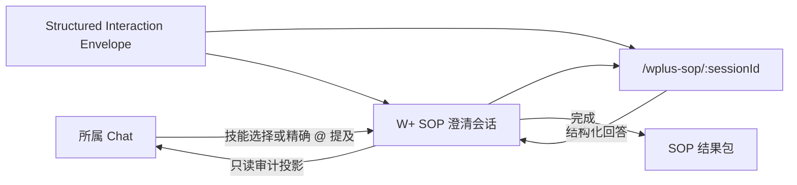
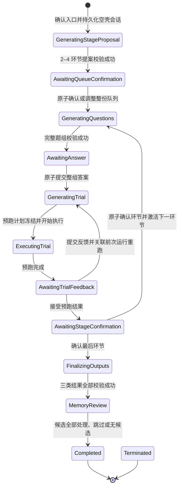

# W+ SOP 工作台与 Chat 恢复卡设计

日期：2026-07-17

## 摘要

CoPaw 为 `wplus-sop-miner` 增加专用的 W+ SOP 工作台。工作台通过 `/wplus-sop/:sessionId` 展示结构化问题、按钮、自由文本输入、历史修订、最终 SOP 和记忆候选，但它不是新的 Chat，也不是面向所有技能的通用工作台。

每个 W+ SOP 澄清会话必须绑定一个所属 Chat。工作台中的每次回答仍作为该 Chat 的一次 Agent 回合提交；Chat 保存只读、可审计的提问、回答和修订记录，并通过一张持续更新的会话控制卡以及输入区上方的恢复条提供返回或恢复入口。

底层交互使用可校验的 `Structured Interaction Envelope`，不解析模型输出的 Markdown 来生成按钮。协议保持中性和可扩展，但第一版产品入口、页面和状态机只服务 W+ SOP Miner。

## 目标

- 在 CoPaw SPA 内提供专用 W+ SOP 澄清页面。
- 让页面按钮提交作用于所属 Chat 的同一 Agent 工作流。
- 支持单选、多选、自由文本和同轮 1–3 题原子提交。
- 支持刷新恢复、暂停恢复、过程回看、答案修订和最终结果导出。
- 在 Chat 中形成简洁、不可篡改的审计轨迹。
- 在 SOP 活动期间锁定普通 Chat 输入，避免并行写入破坏状态。
- 保持 Miner 原有的能力边界、最终 SOP 校验和记忆明确授权流程。

## 非目标

- 第一版不建设通用的“交互式技能工作台”产品入口。
- 第一版不提供 SOP 中心、历史任务列表或跨 Chat 搜索；恢复只从所属 Chat 卡片进入。
- 第一版不自动或一键调用 `wplus-skill-builder`。
- 第一版不新增敏感文本检测、拦截或自动脱敏能力；Miner 和 CoPaw 的既有隐私规则不变。
- 工作台不在浏览器中执行 W+、OpenCLI、MCP 或真实客户数据操作；预跑由
  CoPaw 后端 Agent 与受控工具运行时执行。
- 不允许在 Chat 和工作台两处同时作答。
- 不允许修改已完成或已彻底结束的会话。

## 产品边界



工作台是所属 Chat 的专用视图。`sessionId` 标识 SOP 会话，`chatId` 标识拥有它的 Chat；两者不能互换。一个 Chat 可以先后拥有多个历史 SOP 会话，但同一时间最多只能有一个活动中或已暂停的会话。

## 进入工作台

### 显式调用

用户明确调用 `wplus-sop-miner` 时，Chat 先以已经提交的原始消息渲染
“进入 W+ SOP 工作台”卡片。用户确认后：

1. 后端以幂等入口命令创建状态为 `GeneratingStageProposal` 的空壳 SOP
   澄清会话。
2. Chat 入口卡原地转为会话控制卡。
3. 后端使用原始消息启动所属 Chat 的 Miner 回合。
4. 创建成功后导航到 `/wplus-sop/:sessionId`。
5. 页面先展示环节生成状态；完整的 2–4 环节提案通过校验并由用户确认或
   调整后，才开始生成第一个澄清题组。

用户不需要再次输入需求。显式入口必须先经卡片确认，不得在用户确认前创建
SOP 会话或启动 Miner。普通消息文本和模糊语义不触发新的 W+ SOP 入口。

### 显式技能调用

用户通过 Chat 技能选择器选择 `wplus-sop-miner`，或在消息正文手动输入独立、精确的
`@wplus-sop-miner` 提及时，Chat 显示可点击的确认卡。裸技能名、近似名称和普通 SOP
语义不构成入口授权。

- `确认进入`：幂等创建空壳会话，复用原始消息并开始生成 2–4 环节提案。
- `继续普通 Chat`：取消本轮 Miner 调用，将原始请求交回普通 Chat Agent
  恰好处理一次。

拒绝后，本轮必须携带 Miner 抑制标记，避免同一原始请求再次触发相同确认
卡。拒绝不会创建 SOP 澄清会话。双标签页或网络重试重复确认同一个入口命令
时，后端返回同一会话和同一启动 receipt，不启动第二个 Agent 回合。

确认卡执行后保留在 Chat 历史中，按钮变为不可重复执行的最终状态。

## 路由和恢复

- 工作台路由为 `/wplus-sop/:sessionId`。
- 后端根据当前租户、用户、`sessionId` 和所属 `chatId` 校验访问权限。
- 直接刷新或重新打开工作台时，前端从后端读取持久化会话，不依赖页面内存恢复。
- 用户只是通过侧边栏、浏览器返回或其他导航离开工作台时，会话状态不改变。
- 活动会话仍锁定所属 Chat，Chat 显示 `返回 SOP 工作台`。
- 只有明确点击 `保存并退出` 才会暂停会话并恢复 Chat 输入。
- 第一版没有 SOP 中心；用户只能从所属 Chat 的控制卡或固定恢复条重新进入。

## 状态机



所有生成态和等待用户输入态、`RecoverableFailure`、`MemoryReview` 都属于
活动状态。生成或执行中请求退出时先进入 `PendingExit`，当前完整事件落盘后
再进入 `Paused` 或 `Terminated`；稳定等待态可以直接暂停或终止。

### 状态约束

- 活动状态：Chat 输入锁定；工作台是唯一写入口。
- 已暂停：Chat 输入恢复；控制卡和恢复条显示 `继续 SOP`。
- 已完成：Chat 输入恢复；结果和历史永久只读。
- 已彻底结束：Chat 输入恢复；只保留终止摘要和历史，不能恢复。
- 已完成或已彻底结束后，同一 Chat 可以创建新的 SOP 会话。
- 暂停时记录 `resume_state`；恢复只回到已持久化的等待态或待生成点，绝不
  因刷新、重连或恢复而静默重跑预跑。
- `ExecutingTrial` 重启对账只能恢复原 `run_id`、确认其已结束，或进入
  `RecoverableFailure`；不得创建第二次执行。

## 结构化交互协议

Agent 工作流和界面之间使用专门的结构化信封。Markdown 文本可以作为可读内容，但不是按钮和状态的事实来源。

建议的公共信封字段：

```json
{
  "object": "structured_interaction",
  "protocol_version": 1,
  "interaction": "wplus_sop",
  "event_id": "evt_...",
  "session_id": "sop_...",
  "chat_id": "chat_...",
  "revision": 1,
  "round": 3,
  "state_version": 8,
  "kind": "question_batch",
  "payload": {}
}
```

第一版 `kind` 至少包括：

- `stage_proposal`
- `stage_queue_confirmed`
- `lifecycle_progress`
- `question_batch`
- `answer_accepted`
- `trial_plan`
- `trial_execution_started`
- `trial_execution_progress`
- `trial_execution_completed`
- `trial_execution_failed`
- `trial_feedback_accepted`
- `stage_confirmation_required`
- `stage_confirmed`
- `revision_applied`
- `sop_result`
- `memory_candidates`
- `recoverable_failure`
- `session_state_changed`
- `termination_summary`

### 题组

每个 `question_batch` 包含 1–3 题。题型为：

- `single_select`
- `multi_select`
- `free_text`

有证据支持的选项可以包含 `其他：请补充`；没有证据支持选项时使用自由文本，不得为适配 UI 编造选项。

每题需要稳定的 `question_id`；每个选项需要稳定的 `option_id`。前端只在完整题组通过 schema 校验后一次性展示全部控件。生成期间可以实时展示阶段和进度，但不能逐个开放尚未完成的按钮。

### 环节队列调整

V1 支持新增、改名、重排和删除环节。客户端每次提交完整队列；后端必须原子
校验 2–4 个非空、名称唯一且 `stage_id` 稳定唯一的环节。校验失败、版本冲突
或非法状态时不写事件、不写 Chat 投影，也不启动 Agent。

### 回答提交

一轮题组填写完整后统一提交：

- 携带 `session_id`、`round`、`revision`、`expected_state_version` 和幂等 `request_id`。
- 后端先校验会话仍活动、版本仍匹配、题组仍是当前有效题组。
- 成功后原子保存整轮回答，向 Chat 追加一条回答摘要，只触发一次 Miner 回合。
- 重复 `request_id` 返回原结果，不能追加第二条 Chat 消息或启动第二次生成。
- 过期题组或版本冲突返回当前状态，前端刷新后提示用户该页面已更新。
- 每个用户动作使用稳定 `command_request_id`；真正的首次执行、失败重试和
  反馈重跑分别创建新的 `run_id`/`attempt_id`，并使用
  `retry_of_run_id` 或 `rerun_of_run_id` 记录谱系。网络重发同一命令不能被
  解释成新的重跑。

## Chat 投影

### 会话控制卡

每个 SOP 会话只有一张可变的控制卡，状态就地更新：

- 进行中
- 正在退出
- 已暂停
- 生成失败，可恢复
- 已完成
- 已彻底结束

控制卡展示会话标题、当前环节、已完成进度、最后更新时间和对应操作。它是导航与恢复入口，不承担回答提交。

### 固定恢复条

所属 Chat 的输入区上方显示由当前会话状态派生的轻量恢复条：

- 活动中：`返回 SOP 工作台`
- 已暂停：`继续 SOP`
- 已完成或已彻底结束：不显示

恢复条不是 Chat 消息，不会造成重复审计记录。

### 不可变审计记录

以下事件追加到 Chat，已有消息不被改写：

- Miner 的题组：只读问题摘要和 `返回 SOP 工作台`。
- 用户回答：每轮一条摘要，依次列出 1–3 组问题与回答。
- 答案修订：旧值、新值、修订号和受影响的后续轮次。
- 最终 SOP 生成、记忆选择、正常完成或彻底结束。

每条记录携带 `session_id`、轮次和修订号。失效的旧题组、回答和派生结果继续显示，但明确标记 `已失效`。Miner 只消费当前有效修订。

## Chat 输入锁定

活动 SOP 会话存在时：

- 普通输入控件不可提交。
- 输入区说明当前 Chat 正由 SOP 工作台占用。
- 提供 `返回 SOP 工作台` 和 `结束 SOP 工作台`。

`结束 SOP 工作台` 打开三选一对话框：

1. `保存并退出`
2. `彻底结束`
3. `取消，继续 SOP`

暂停后普通 Chat 可以继续使用，但暂停期间的新消息不自动加入 SOP。恢复时，以持久化 SOP 状态、当前有效修订和明确的 SOP 事件为上下文，不直接把暂停期间的普通 Chat 消息混入 Miner 状态。

## 保存退出与彻底结束

### 保存并退出

- 保存当前稳定状态。
- 状态变为 `Paused`。
- 恢复 Chat 输入。
- 控制卡和固定恢复条提供 `继续 SOP`。
- 恢复后回到未回答题组；如果保存点位于待生成处，则继续同一个待处理阶段。

### 彻底结束

- 状态变为不可恢复的 `Terminated`。
- 恢复 Chat 输入。
- 生成或保存只读终止摘要，包括：已确认事实、明确未知项、未决问题、已完成/未完成环节和终止位置。
- 终止摘要必须醒目标注 `不是有效 SOP`，不能下载为 Builder 可消费的结果包。

### 生成过程中退出

结束按钮始终可用。生成中选择保存退出或彻底结束时：

1. 状态变为 `PendingExit`，停止接受新回答。
2. 当前运行继续到完整响应落盘。
3. 不再基于该响应自动开始下一轮。
4. 应用用户已经选择的暂停或终止动作。

## 历史答案修订

修订仅允许在活动会话的稳定题组界面进行。暂停会话必须先恢复；已完成和已彻底结束会话永久只读。

用户修改第 N 轮答案时：

1. 页面展示将被作废的后续轮次和派生结果。
2. 用户确认提交修改。
3. 修订号递增。
4. 第 N 轮之后的题组、回答、SOP 结果和尚未执行的记忆选择全部失效。
5. Chat 追加修订审计记录，旧记录不删除。
6. Miner 从第 N 轮的新答案和此前仍有效的状态重新生成。

第一版没有分支式修订；任一时刻只有一条当前有效修订链。

## 最终 SOP 与记忆候选

所有环节完整后，Miner 仍按自身契约：

1. 生成 `sop_spec.json`。
2. 运行 schema、结构和隐私校验。
3. 生成面向用户的可读 SOP。
4. 生成经过转义的 HTML 可视化文件。
5. 展示有本轮证据支持的记忆候选。

最终 SOP 生成不立即完成会话。工作台进入 `MemoryReview`，对每个候选提供 `同意保存` 和 `不保存`，并提供 `跳过全部`。只有全部候选已处理或跳过后，状态才自动变为 `Completed`。

完成时：

- 立即恢复 Chat 输入。
- 用户仍停留在最终结果页。
- 页面提供 `返回 Chat`。
- 控制卡显示 `已完成，可回看`。
- 最终结果包提供可读 SOP、`sop_spec.json` 和 HTML 的查看或下载。
- 页面仅提示结果已经可以交给 `wplus-skill-builder`，不调用 Builder。

## 错误、断线和重试

- 网络断开时，前端首先使用现有 Chat 运行重连语义连接同一个运行，不创建新回合。
- 只有确认原运行已经终止失败，才进入 `RecoverableFailure`。
- 错误页保留最后稳定状态，并提供：`重试本轮`、`保存并退出`、`彻底结束`。
- `重试本轮` 使用稳定的幂等请求标识，不重复保存用户回答，不追加重复 Chat 审计记录。
- 重试结果仍必须通过完整结构校验后才能开放交互。
- 无法识别或 schema 不合法的结构化输出属于可恢复失败，不能退化成从 Markdown 猜测按钮。

## 持久化和一致性

后端持久化状态是唯一事实来源。至少保存：

- SOP 会话 ID、所属 Chat ID、租户和用户归属。
- Miner 技能版本或内容快照标识。
- 当前状态、状态版本、修订号和轮次。
- 环节队列、当前环节、已确认事实、明确未知项、假设和未决问题。
- 当前有效题组和回答。
- 失效历史及其失效原因。
- 当前运行 ID、幂等请求和待执行退出动作。
- 命令 receipt、运行 attempt 谱系、持久化 Chat 投影 outbox 和投影去重 ID。
- 最终 SOP 结果、记忆候选处理状态或终止摘要。

必须由后端保证：

- 一个 Chat 最多一个活动或暂停会话。
- 状态转换使用预期版本检查。
- 同一回答、重试、退出和记忆选择操作幂等。
- W+ 事件日志是唯一提交点；Chat 投影通过同一提交中的持久化 outbox
  确定性补写，并按投影事件 ID 去重。Chat 写失败或进程在两次写之间重启时，
  对账器必须补齐投影且不能重复。
- 前端刷新、重复点击、双标签页和 SSE 重连不能产生双重 Agent 回合。
- SSE 只提供实时提示，持久化 Session 投影才是恢复真源。前端忽略重复或旧
  `state_version`；发现版本缺口立即停止应用增量并重新 GET 当前投影。
- V1 的本地 JSON 写路径只支持单进程桌面部署；启用多 worker 前必须切换到
  支持跨进程事务和锁的数据库 store。
- 所有读写、SSE、结果下载和 active-session lookup 都校验
  tenant/source/user/agent/chat 归属。缺失身份或归属不匹配统一 fail closed；
  对不可访问会话返回 404，不泄露其是否存在。

## 与现有代码的衔接点

以下是设计阶段确认的主要扩展边界，不代表最终文件拆分：

- `console/src/layouts/MainLayout/index.tsx`：注册 `/wplus-sop/:sessionId` 路由。
- `console/src/pages/Chat/index.tsx`：注册进入确认卡、会话控制卡、只读题组/回答/修订卡和输入锁定投影。
- `console/src/pages/Chat/components/ApprovalActionCard.tsx`：可参考其结构化按钮提交模式，但 W+ SOP 不复用审批语义。
- `console/src/components/agentscope-chat/AgentScopeRuntimeWebUI/core/Chat/hooks/useChatRequest.tsx`：扩展结构化 SSE 事件识别和 Chat 卡片投影。
- `console/src/components/ConversationQuickNav/hooks/useQuestionMessages.ts`：可参考历史问题导航，但 SOP 修订和有效性必须来自 SOP 会话状态。
- `src/swe/app/routers/console.py::post_console_chat`：继续承载所属 Chat 的 Agent 运行、SSE 和活动运行重连。
- Chat 的受信任技能选择结果或正文中的精确 `@wplus-sop-miner` 提及可以创建新入口；
  普通文本语义推断不得产生 W+ 进入卡。显式调用先产生进入卡，用户确认后才创建
  Session 并启动 Miner。

实施前必须按仓库规则对所有将修改的符号逐个执行 GitNexus upstream impact 分析；当前设计阶段没有修改业务符号。

## API 能力边界

最终路径命名在实施计划中确认，但后端需要覆盖以下能力：

- 读取一个可访问的 SOP 会话及其当前投影。
- 确认显式进入提议；确认操作先创建空壳 Session，再启动 Miner。历史隐式提议的
  拒绝与回放协议仅作为已落盘数据的兼容路径保留。
- 原子确认或调整完整的 2–4 环节队列。
- 提交一轮结构化回答。
- 接受预跑结果、提交反馈并关联前次运行重跑、确认当前环节。
- 修订历史答案。
- 保存退出、恢复或彻底结束。
- 查询或重连当前生成运行。
- 幂等重试失败回合。
- 提交记忆候选选择。
- 预览并明确确认最终结果；结果确认前不得进入记忆处理或完成态。
- 最终化 Agent 必须生成、校验并通过 `copy_file_to_static` 交付四个结果文件；平台只持久化和验证真实 static 元数据，不在下载时合成文件。
- 批准记忆候选后启动绑定该候选的 `WritingMemory` Agent 回合，由 Agent 调用 Miner 的 `scripts/memory_store.py ... --approved`；平台校验 appended/duplicate 回执，不在请求线程写 JSONL，不得写根目录 `MEMORY.md`，失败可重试。
- 下载最终结果包中的四个真实 static 产物。

所有写操作必须校验所属 Chat、当前状态、预期状态版本和幂等请求标识。

## 验收标准

### 进入

- 技能选择或正文精确 `@wplus-sop-miner` 提及显示确认卡；确认前不创建 Session、不启动 Miner。
- 确认后先持久化 `GeneratingStageProposal` 空壳 Session，再使用原始消息
  启动 Miner；原始消息无需重输。
- 未显式调用 Miner 的普通消息直接进入普通 Chat，不创建进入提议或 Session。
- 重复确认同一入口命令返回同一 Session 且只有一个 Agent 回合。
- 同一 Chat 已有活动或暂停会话时，不能再创建第二个。

### 作答和审计

- 单选、多选、自由文本和 1–3 题批量提交均可用。
- 完整题组校验前没有可点击的半成品选项。
- 一次批量提交只产生一条 Chat 回答摘要和一次 Miner 回合。
- Chat 题组卡只读，不能绕过工作台提交。
- 环节队列只能整份原子提交；新增、改名、重排和删除后仍必须满足 2–4 个
  非空唯一环节。

### 恢复和退出

- 刷新工作台可恢复当前会话。
- 导航离开不自动暂停。
- 保存退出恢复 Chat 输入，固定恢复条可重新进入。
- 生成中退出等待当前响应稳定保存后生效。
- 彻底结束不可恢复且不产生有效 SOP。

### 修订

- 修改历史答案会递增修订号并作废全部后续结果。
- 旧 Chat 消息保留并标记失效，新修订以追加消息记录。
- 完成或终止的会话不能编辑。

### 完成

- 最终 SOP 通过 Miner 校验后才展示结果包。
- 记忆候选必须逐项处理或跳过全部，之后才自动完成。
- 完成后 Chat 输入恢复，用户仍停留在结果页。
- 第一版不存在 Builder 自动调用或一键调用。

### 一致性

- 重复点击、双标签页、断线重连和重复请求不产生重复回答或重复 Agent 回合。
- 过期页面提交被版本检查拒绝并刷新到服务器状态。
- 控制卡、固定恢复条和工作台显示同一个后端状态。
- Session 成功而 Chat 写失败时，持久化 outbox 在重试或重启后只补写一次。
- SSE 重复或乱序不回退页面；出现 `state_version` 缺口时重取 Session 投影。
- 错 user/source/agent/chat 的读、写、订阅和下载均返回不可访问且不改变状态。

## 测试范围

- 后端状态机的合法和非法转换。
- 一个 Chat 单活动/暂停会话约束。
- 进入确认、拒绝抑制和原请求回退。
- 环节队列新增、改名、重排、删除、原子校验和并发冲突。
- 题组 schema、题型、原子提交和幂等。
- 修订后的级联失效和 Chat 追加式审计。
- 活动运行重连、终止失败和幂等重试。
- 生成中暂停/终止的延迟生效。
- 记忆候选明确授权及正常完成。
- 租户、用户、Chat 和 SOP 会话访问隔离。
- 路由刷新、固定恢复条、输入锁定和只读历史。
- 已完成与已终止会话的永久只读行为。
- SSE 重复、乱序、版本缺口和运行中进程重启对账。
- Session 已提交但 Chat 投影失败后的 outbox 恢复。
- 完整两环节流程，包含一次反馈重跑、一次暂停恢复和最终 MemoryReview。

## 后续实施规划需要确定的细节

以下内容不改变本设计的产品语义，可在实施计划中根据仓库现状确定：

- SOP 持久化仓储的具体目录、表结构和迁移方式。
- Structured Interaction Envelope 的内部 Pydantic/TypeScript 类型拆分。
- SOP 页面组件拆分和视觉设计。
- API 路径的最终命名。
- Miner 如何以最小改动发出结构化题组和最终结果事件。
