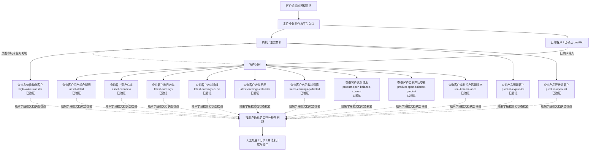

# W+ 平台功能说明（澄清知识）

> 本文件由 `references/capability-registry.json` 生成。它把已知 OpenCLI 的功能描述、页面入口和流程关系组织成平台功能树与知识图，供 SOP 澄清时定位能力使用；它不是 W+ 全量产品手册，也不是 OpenCLI 执行编排。

## 目录

- 使用边界
- 平台功能树
- 平台功能知识图
- OpenCLI 能力说明
- 在澄清中的使用方法

## 使用边界

- 图中的页面连线是页面导航关系，不代表可执行数据依赖。只有注册表明确记录了输出字段，而且后续能力明确接受该字段时，才可以把两个 OpenCLI 视为可编排的数据链路。
- 客户洞察类能力所需的 `custUid` 必须由用户输入或已验证的前序输出提供。当前商机列表能力的输出字段尚未文档化，不能假设它们会返回 `custUid`。
- `部分验证` 或 `未验证` 的能力只能作为待确认选项，不能升级为已验证事实。
- 当前登记能力均为只读查询。分析判断、创建待办、写商机、客户沟通、配置调整和跟进记录等动作，应标为 `analysis`、`human_action` 或 `unsupported`，不能伪装成 OpenCLI 写能力。
- 如果本说明与用户当前说法冲突，以用户当前说法为准，并把差异记录为知识更新候选。

## 平台功能树

```text
W+ 平台
├─ 商机
│  └─ 商机中心 → 重要商机
│     ├─ 查询高价值动账客户 → 读取高价值动账商机列表；页面筛选维护状态与适配器筛选能力需要进一步验证。 [OpenCLI: high-value-transfer; 已验证]
│     ├─ 查询产品到期客户 → 按状态、产品分类、到期日期或产品名称读取产品到期商机列表。 [OpenCLI: product-expire-list; 已验证]
│     └─ 查询产品开放期客户 → 按状态、产品分类、开放日期或产品名称读取产品开放期商机列表。 [OpenCLI: product-open-list; 已验证]
└─ 客户洞察（进入前需有用户确认或已验证来源的 custUid）
   ├─ 客户资产
   │  ├─ 查询客户资产组合明细 → 按日或按月读取客户资产组合明细。 [OpenCLI: asset-detail; 已验证]
   │  └─ 查询客户资产总览 → 读取资产走势或持仓报告。 [OpenCLI: asset-overview; 已验证]
   ├─ 客户收益
   │  ├─ 查询客户昨日收益 → 读取客户最新收益中的昨日收益。 [OpenCLI: latest-earnings; 已验证]
   │  ├─ 查询客户收益曲线 → 按本月、今年或累计范围读取客户收益曲线。 [OpenCLI: latest-earnings-curve; 已验证]
   │  ├─ 查询客户收益日历 → 读取指定范围的客户收益日历。 [OpenCLI: latest-earnings-calendar; 已验证]
   │  └─ 查询客户产品收益详情 → 读取客户在指定日期的产品收益详情。 [OpenCLI: latest-earnings-prddetail; 已验证]
   ├─ 客户流水
   │  ├─ 查询客户活期流水 → 从产品开放期客户上下文读取活期账户交易流水。 [OpenCLI: product-open-balance-current; 已验证]
   │  └─ 查询客户实时资产活期流水 → 从实时资产页面读取活期账户交易流水。 [OpenCLI: real-time-balance; 已验证]
   └─ 客户交易
      └─ 查询客户实时产品交易 → 读取客户实时产品交易记录。 [OpenCLI: product-open-balance-product; 已验证]
```

## 平台功能知识图

这张图用于澄清时定位“从哪里进入、能查询什么、哪里需要人工判断”。虚线表示知识关联或待校验结果，不表示可直接执行的参数传递。



## OpenCLI 能力说明

| 功能域 | 能力与用途 | 页面/流程证据 | 入参摘要 | 输出状态 | 能力标识 | OpenCLI 适配器 | 验证状态 |
| --- | --- | --- | --- | --- | --- | --- | --- |
| 客户资产 | 查询客户资产组合明细：按日或按月读取客户资产组合明细。 | 客户洞察 → 资产明细 → 资产组合（按日/按月） | `custUid`（必填）、`bbkOrgId`（可选）、`type`（可选） | 输出字段未形成文档，不得推断 | `customer.asset-detail.query` | `asset-detail` | 已验证 |
| 客户资产 | 查询客户资产总览：读取资产走势或持仓报告。 | 客户洞察 → 资产总览 | `custUid`（必填）、`type`（必填） | 输出字段未形成文档，不得推断 | `customer.asset-overview.query` | `asset-overview` | 已验证 |
| 重要商机 | 查询高价值动账客户：读取高价值动账商机列表；页面筛选维护状态与适配器筛选能力需要进一步验证。 | 商机 → 商机中心 → 重要商机 → 高价值动账 | `tskStsCd`（可选）、`frsLvlCd`（可选）、`startDate`（可选）、`endDate`（可选）、`minAmount`（可选）、`maxAmount`（可选） | 输出字段未形成文档，不得推断 | `opportunity.high-value-transfer.list` | `high-value-transfer` | 已验证 |
| 客户收益 | 查询客户昨日收益：读取客户最新收益中的昨日收益。 | 客户洞察 → 最新收益 → 昨日 | `custUid`（必填） | 输出字段未形成文档，不得推断 | `customer.latest-earnings.query` | `latest-earnings` | 已验证 |
| 客户收益 | 查询客户收益曲线：按本月、今年或累计范围读取客户收益曲线。 | 客户洞察 → 最新收益 → 本月/今年/累计 | `custUid`（必填）、`dateType`（必填） | 输出字段未形成文档，不得推断 | `customer.earnings-curve.query` | `latest-earnings-curve` | 已验证 |
| 客户收益 | 查询客户收益日历：读取指定范围的客户收益日历。 | 客户洞察 → 最新收益 → 收益日历 | `custUid`（必填）、`dateType`（必填） | 输出字段未形成文档，不得推断 | `customer.earnings-calendar.query` | `latest-earnings-calendar` | 已验证 |
| 客户收益 | 查询客户产品收益详情：读取客户在指定日期的产品收益详情。 | 客户洞察 → 最新收益 → 产品详情 | `custUid`（必填）、`date`（必填） | 输出字段未形成文档，不得推断 | `customer.earnings-product-detail.query` | `latest-earnings-prddetail` | 已验证 |
| 重要商机 | 查询产品到期客户：按状态、产品分类、到期日期或产品名称读取产品到期商机列表。 | 商机 → 商机中心 → 重要商机 → 产品到期 | `tskStsCd`（可选）、`frsLvlCd`（可选）、`startDate`（可选）、`endDate`（可选）、`prodName`（可选） | 输出字段未形成文档，不得推断 | `opportunity.product-expiry.list` | `product-expire-list` | 已验证 |
| 重要商机 | 查询产品开放期客户：按状态、产品分类、开放日期或产品名称读取产品开放期商机列表。 | 商机 → 商机中心 → 重要商机 → 产品开放期 | `tskStsCd`（可选）、`frsLvlCd`（可选）、`startDate`（可选）、`endDate`（可选）、`prodName`（可选） | 输出字段未形成文档，不得推断 | `opportunity.product-open.list` | `product-open-list` | 已验证 |
| 客户流水 | 查询客户活期流水：从产品开放期客户上下文读取活期账户交易流水。 | 产品开放期客户 → 客户洞察 → 实时收支 → 活期流水 | `custUid`（必填）、`bbkOrgId`（可选）、`crdNbr`（可选）、`startDate`（可选）、`endDate`（可选）、`startAmt`（可选）、`endAmt`（可选） | 已记录字段：`trxDate`、`trxType`、`trxAmount`、`balance`、`trxCounter`、`trxSummary` | `customer.cashflow-current.query` | `product-open-balance-current` | 已验证 |
| 客户交易 | 查询客户实时产品交易：读取客户实时产品交易记录。 | 产品开放期客户 → 客户洞察 → 实时收支 → 实时产品交易 | `custUid`（必填）、`bbkOrgId`（可选）、`cardNbr`（可选）、`startDate`（可选）、`endDate`（可选）、`trxTimeSort`（可选）、`ptflFilterFlag`（可选） | 已记录字段：`prodCode`、`prodName`、`prodType`、`trxType`、`trxAmount`、`trxTime`、`trxStatus` | `customer.product-transaction.query` | `product-open-balance-product` | 已验证 |
| 客户流水 | 查询客户实时资产活期流水：从实时资产页面读取活期账户交易流水。 | 客户洞察 → 实时资产 → 活期流水 | `custUid`（必填）、`bbkOrgId`（可选）、`crdNbr`（可选）、`strDte`（可选）、`endDte`（可选） | 输出字段未形成文档，不得推断 | `customer.realtime-balance.query` | `real-time-balance` | 已验证 |

## 在澄清中的使用方法

1. 根据用户原始需求，在功能树中定位最接近的模块与功能域；找不到时，不要硬套现有能力。
2. 用知识图把需求拆成真实业务动作，例如“查询商机名单 → 查看客户明细 → 按确认口径判断 → 人工跟进”，但先让用户确认动作顺序。
3. 在当前环节提问时，只把本图中有注册表证据的页面、数据范围和 OpenCLI 能力作为选项；字段、阈值和业务规则仍需用户确认。
4. 选择能力后，回到能力注册表核对完整入参、允许值、输出文档状态和验证状态，不要仅凭本图生成执行参数。
5. 若需要从商机名单进入客户洞察，必须先确认 `custUid` 的来源；在列表输出契约未补齐前，将该衔接记录为缺口，而不是自动编排。

生成来源版本：`2026-07-14.1`；能力数量：`12`。
